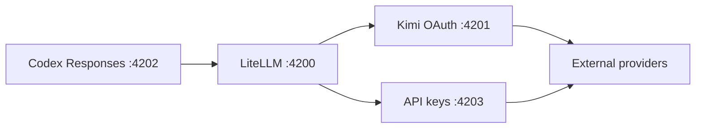

# Codex Fusion — Destiney Reproducible v1

**Codex Fusion** is the `destineylu/codex-fusion` enhanced Codex workspace: it combines the Codex Router core with Control Center, ChatGPT Web Bridge, Codex Native2 Full Harness, Auto Resume, and project-scoped Single / Team integration. End-user installs and self-updates follow `destineylu/codex-fusion`, while the original `duolahypercho/codex-router` repository remains configured as the reference upstream for reviewed Router upgrades. ChatGPT Web and Codex Auto Resume are likewise pinned to audited upstream revisions instead of auto-updating behind the operator's back. See [`docs/REPRODUCIBLE-V1.md`](docs/REPRODUCIBLE-V1.md) for the distribution and upgrade contract.

For v1 compatibility, the routing engine is still named **Codex Router** internally. Existing paths, scripts, provider IDs, services, scheduled tasks, and sidecar directories such as `%LOCALAPPDATA%\codex-router`, `codex-router.ps1`, `model-router.ps1`, and `codex-router-sidecars` intentionally keep their established names. The product brand changed; the proven runtime plumbing did not.

## 中文：从零开始，照着做即可完成安装

这一版不是单独的 Router，而是把几套已经验证过的能力组合在一起，同时保持它们彼此隔离：

| 组件 | 作用 | 是否必须 |
| --- | --- | --- |
| Codex Router（核心模块） | 让 Codex 使用 DeepSeek、Claude、GLM、Kimi、xKiro、Command Code、OpenRouter 等外部模型 | 必须 |
| Control Center | 图形化管理 Provider、模型、Usage、原生 GPT 多账号、Settings、ChatGPT Web、Auto Resume | Windows 推荐安装 |
| ChatGPT Web Bridge | 把你自己的 ChatGPT Web 账户作为 Codex 模型使用，不走普通模型 API | 可选 |
| Codex Native2 Full Harness | 让 ChatGPT Web 模型继续使用当前 Codex 的本地工具、命令、补丁等能力 | 可选，高级 |
| Codex Auto Resume | 原生 Codex 因额度用尽停止后，在额度恢复时继续原 thread | 可选 |
| Single / Team | 对指定项目切换 Codex Native Multi-Agent 能力 | 可选，项目级 |
| ComfyUI Port | Codex 的 ComfyUI 工作流/面板集成 | 可选，独立仓库，不随 Router 自动安装 |

### 感谢原作者与上游项目

Codex Fusion 不是把多个开源项目重新包装后声称为自己的原创。它建立在多个优秀上游项目之上，并把它们通过审核、隔离、兼容层和统一 Control Center 组合成一套可复刻的 Codex 工作环境。特别感谢：

- **Codex Router**：<https://github.com/duolahypercho/codex-router>，提供整个多 Provider / 多模型路由核心；
- **codex-chatgpt-web**：<https://github.com/miuuyy/codex-chatgpt-web>，提供 ChatGPT Web launcher/runtime，Codex Fusion 在其外层增加固定版本审计、隔离和生命周期管理；
- **codex-auto-resume**：<https://github.com/feifeigong/codex-auto-resume>，提供 Codex 原 thread 在额度恢复后的续跑能力，Codex Fusion 负责以独立 sidecar 方式接入 Control Center；
- 以及 `opencodex`、`devin-2api`、Primer Octicons 等项目和贡献者提供的实现思路、协议研究或资源。

每个上游项目仍保留自己的作者、仓库历史和许可证。更完整的来源与归属见 [`NOTICE.md`](NOTICE.md)。感谢所有原作者和贡献者让这些能力成为可能。

### 先选你的使用方式

如果你是第一次安装，先确定自己属于下面哪一种。**不要为了“功能多”把所有东西一次性全开。**

**A. 只想在 Codex 中使用普通 API / 订阅 Provider**，例如 DeepSeek、OpenRouter、Command Code、xKiro、xKiro2、Anthropic、GLM 等：使用下面的“API Provider 路线”。

**B. 只想使用 ChatGPT Web，不准备配置其他 API Provider**：安装 Router 时用 `-NoProvider`，然后在 Control Center 里安装 ChatGPT Web。不要用 `-NoDiscovery`，因为后面仍需要正常发现本机的 ChatGPT Web Provider。

**C. 想让 ChatGPT Web 不但能回答，还能继续使用 Codex 的本地工具**：先完成 B，再完成“Full Harness / Tunnel”章节。Browser-only 能聊天，但没有完整本地工具；Full Harness 才把工具调用接回当前 Codex task。

### 第 0 步：Windows 安装前准备

当前组合版最完整、验收最充分的是 **Windows 11 x64 + Codex Desktop**。Router 本身也支持 macOS/Linux，但本仓库的 guarded ChatGPT Web Control Center 安装器目前只对 Windows x64 开放。

先安装以下软件：

1. **Codex Desktop 或 Codex CLI**。如果准备使用原生 GPT，也先在 Codex 中完成你的 OpenAI/ChatGPT 登录。
2. **Git for Windows**。
3. **Node.js 22.19+**，推荐 Node.js 24 LTS。
4. **Python 3.10+**，推荐 Python 3.12。也可以安装 `uv`；安装器会优先使用 `uv`，没有时使用 Python `venv`。

Windows 11 可以在管理员或普通 PowerShell 中使用 `winget`：

```powershell
winget install --id Git.Git -e
winget install --id OpenJS.NodeJS.LTS -e
winget install --id Python.Python.3.12 -e
```

安装完成后**关闭当前 PowerShell，重新打开一个新的 PowerShell**，然后检查：

```powershell
git --version
node --version
npm --version
python --version
```

正常情况下至少应看到：

```text
Git 有版本号
Node >= 22.19.0
npm 有版本号
Python >= 3.10
```

如果 `python` 命令不存在但你已经安装 `uv`，也可以继续；如果 Node 或 Git 不存在，不要继续安装 Router。

### 第 1 步：安装 Codex Fusion（Router + Control Center）

#### 路线 A：准备使用普通 API Provider

复制下面整段到 PowerShell：

```powershell
$installer = Join-Path $env:TEMP "codex-router-install.ps1"
Invoke-WebRequest https://raw.githubusercontent.com/destineylu/codex-fusion/main/install.ps1 -OutFile $installer
powershell.exe -NoProfile -ExecutionPolicy Bypass -File $installer -Target codex -Guided -WithTray
```

安装器会依次完成：

```text
下载 destineylu/codex-fusion
→ 安装 Node / Python 依赖
→ 选择 Provider
→ 选择要显示的模型
→ 安全输入 API Key / OAuth 登录
→ 安装 Router 服务
→ 写入 Codex Router 配置
→ 构建并安装 Control Center / Tray
```

在 `Choose providers` 步骤中，用数字选择 Provider；再次输入同一数字可以切换选择。`a` 是全选，`n` 是全不选，直接 Enter 继续。

在 `Choose models` 步骤中，只勾选真正想放进 Codex picker 的模型。Provider 被启用并不代表它整个 catalog 会自动塞进 picker。

输入 API Key 时，使用安装器自己的安全输入提示。**不要把 API Key 写进安装命令，不要把 Key 发到聊天，不要保存到 README、issue 或 Git。**

#### 路线 B：只准备使用 ChatGPT Web

如果你暂时没有任何外部 API Key，使用空 Provider 安装：

```powershell
$installer = Join-Path $env:TEMP "codex-router-install.ps1"
Invoke-WebRequest https://raw.githubusercontent.com/destineylu/codex-fusion/main/install.ps1 -OutFile $installer
powershell.exe -NoProfile -ExecutionPolicy Bypass -File $installer -Target codex -NoProvider -WithTray
```

这会先建立一个“空 Router”。此时外部模型流量还不能工作，这是正常状态；后面把 ChatGPT Web Provider 加进去以后才开始路由。

> 不要加 `-NoDiscovery`。那个参数是做完全无凭据生命周期测试用的，会明确关闭凭据/会话发现，不适合作为 ChatGPT Web 的日常安装方式。

### 第 2 步：确认 Router 基础安装成功

默认安装目录：

```text
%LOCALAPPDATA%\codex-router
```

PowerShell 检查：

```powershell
cd "$env:LOCALAPPDATA\codex-router"
.\model-router.ps1 codex status
.\model-router.ps1 codex doctor
```

然后完全退出 Codex Desktop，再重新打开。**Codex 的模型目录在启动时读取，所以安装/添加模型后不重启 Codex，picker 可能仍然是旧的。**

Control Center 正常有三种打开方式：

- Windows 开始菜单中的 **Codex Router**；
- 系统托盘中的 Codex Router 图标；
- 如果桌面伴侣没有成功建立，可先执行 `cd "$env:LOCALAPPDATA\codex-router"`，再运行 `.\codex-router.ps1 panel` 打开浏览器控制面板；之后可运行 `.\codex-router.ps1 tray install` 修复桌面伴侣。

基础成功标准：

```text
Router service = running
health.ok = true
Codex 重新打开后仍能启动任务
Control Center 能打开
```

### 第 3 步：普通 API Provider 怎么连接

如果第 1 步已经通过 Guided Installer 输入了 Key，可以直接跳到“重新打开 Codex”。如果想以后再添加 Provider，推荐使用 Control Center：

1. 打开 **Control Center → Models**。
2. 在顶部 **Connections** 点击 **Connect provider**。
3. 选择 Provider，例如 DeepSeek、OpenRouter、Command Code、xKiro、xKiro2、Anthropic 等。
4. API Provider 会出现密码输入框，把 Provider 官网生成的 Key 粘贴进去，点击 **Save credential**。
5. Key 只通过受信任的 Electron → Router stdin 路径写入受保护状态；它不会进入命令参数、浏览器 localStorage 或 Git。
6. 如果该 Provider 有动态 catalog，点击 **Add models**。
7. 左侧选择 Provider，点击 **Fetch model list**。
8. 勾选需要的模型，然后点击 **Add selected**。
9. 如果某一模型显示 **Verify & add**，说明 Router 要求先做真实兼容性验证。这个动作会发出小型真实请求，可能消耗 Provider 额度；不想消耗时不要点。
10. 添加完成后完全退出 Codex，再重新打开，模型才会稳定出现在 picker 中。

命令行也可以做同样的事，例如 DeepSeek：

```powershell
cd "$env:LOCALAPPDATA\codex-router"
.\model-router.ps1 codex provider-key deepseek set
.\model-router.ps1 codex providers enable deepseek
```

然后按提示安全输入 Key。

#### API Key 正确但仍然 401/403 时

“有 Key”不等于“账户有该模型权限”。常见情况包括：

- Command Code 的 Go 套餐不包含 Provider API；
- ClinePass 需要有效订阅，只有 API Key 不够；
- Venice、某些 reseller/provider 的模型权限与账户余额/套餐绑定；
- 中国区和国际区 Kimi Key 不互通；
- `xkiro` 与 `xkiro2` 是两个独立账户/凭据槽，不会自动共享 Key。

遇到 401/403 时先检查 Provider 官网的套餐和模型权限，不要反复重装 Router。

### 第 3.5 步：原生 GPT 多账号切换（Windows Codex Desktop）

安装带 `-WithTray` 的 Codex Fusion 后，这项功能已经包含在 Control Center 中，不需要再安装额外的账号切换工具。打开：

```text
Control Center
→ Settings
→ ChatGPT 原生账号
```

点击 **+ 添加 ChatGPT 账号** 时，Control Center 会先把当前 live Codex 登录保存成独立 Profile，再在隔离 `CODEX_HOME` 中调用官方 `codex login` 添加另一个账号。Control Center 不要求输入 ChatGPT 密码，也不会把 OAuth token 写进命令行参数、日志或 Git。

如果常用 Chrome 已经登录账号 A，可以把本次官方 OAuth 授权地址复制到 Chrome 无痕窗口登录账号 B。若最后浏览器停在：

```text
http://localhost:<port>/auth/callback?code=...&state=...
```

但 localhost 页面无法访问，把地址栏中的**完整 URL**粘贴回 Control Center 的 **Codex OAuth 回调 URL**，再点击 **提交回调 URL**。Control Center 只校验 loopback host、callback path、端口、`code` 和 `state`，然后把回调转交给仍在等待的官方 Codex 登录进程；它不会自行实现 OpenAI token exchange。官方 `codex login --device-auth` 也保留为备用入口。

真正切换账号前，先完成当前 Codex turn 并**完全退出 Codex Desktop**，然后在目标 Profile 上点击 **切换**，再重新打开 Codex Desktop。切换过程会同步当前账号最新 auth、写入回滚备份、原子替换 live `auth.json` 并验证目标身份。

**账号切换不会停止或重启 Router 4202/4203，也不会修改 `config.toml`、模型 catalog、第三方 Provider 或 ChatGPT Web Bridge。** 当前版本只做手动显式切换，不做额度耗尽自动换号、账号池轮换或隐式 fallback。

Windows 上 Codex CLI / `app-server` 也可能叫 `Codex.exe`，所以 Control Center 按真实 Desktop 可执行路径判断是否仍有 Codex Desktop 在运行，不会把 npm CLI 或 AppX `resources\codex.exe` 错判成 Desktop。

### 第 4 步：安装 ChatGPT Web Bridge（Browser-only 先跑通）

ChatGPT Web Bridge 使用的是你自己的 ChatGPT 网页账户，不需要普通模型 Provider API Key。它是一个独立 sidecar，生产链路保持：

```text
Codex Desktop
  → 4202 Codex Router
  → 4203 native-session forwarder
  → 127.0.0.1:17841 ChatGPT Web Bridge
  → ChatGPT Web
```

**真实 Codex 必须始终由 Router 拥有路由。不要把 Codex 的 `openai_base_url` 直接改成 17841。**

#### 4.1 安装经过审计的 launcher

打开：

```text
Control Center → Settings → ChatGPT Web Bridge
```

点击：

```text
Install audited v5.0.8
```

本发行版不会下载“latest”后直接运行，而是固定下载已经审计的 v5.0.8，并校验安装包 SHA-256。该版本已知的 browser preflight 15 秒限制也只会在原始 `app.asar` hash 完全匹配时补成 60 秒；未知版本或未知 hash 会拒绝修改。

看到：

```text
Launcher = Installed
```

再继续。

#### 4.2 一定要用 Managed Start

点击：

```text
Managed Start
```

**不要从 Windows 开始菜单直接启动 `Codex Web GPT`。**

Managed Start 会给 launcher 注入独立的：

```text
CODEX_HOME
launcher data directory
managed browser profile
```

因此它无法把真实 Codex 从 Router 改成自己直连 17841。

#### 4.3 在弹出的 Codex Web GPT 窗口登录 ChatGPT

登录必须在 **Managed Start 打开的内嵌浏览器**里完成。你平常 Chrome 里已经登录 ChatGPT，并不代表这个隔离 profile 已登录。

按 launcher 页面提示：

1. 点击登录 ChatGPT。
2. 在这个窗口中完成 OpenAI/ChatGPT 登录。
3. 登录后回到 launcher 的 Setup 页面。
4. 点击 **Browser smoke test** / **Run browser smoke test**。
5. 等待测试通过。

回到 Control Center，应看到：

```text
Browser host = Smoke passed
```

如果仍显示 `Sign in required`，说明登录或 smoke test 还没有在 managed profile 中完成。

#### 4.4 启动 17841 bridge

Browser smoke 通过后，Control Center 的 **Start 17841** 按钮会可用。点击它。

正常状态应变成：

```text
Bridge daemon = Reachable
owner = upstream
Codex route owner = Router
Router provider = Ready to discover
```

然后点击：

```text
Verify isolation
```

只有下面两个条件同时成立才继续：

```text
route owner = Router
17841 reachable = true
```

如果看到 `Conflict`，停止后续操作。它表示真实 Codex 直接指向了 ChatGPT Web，而不是 Router；先运行 Router doctor/repair，不要用“能聊天就算了”的方式继续。

#### 4.5 把你账户实际拥有的 ChatGPT Web 模型加入 Codex

这一点很重要：**不要照抄维护者机器上的 light/medium/high 名称。**不同 ChatGPT 套餐、不同时间、不同 upstream launcher 可能暴露不同模型。发行版从 17841 动态读取你自己的账户 catalog。

在 Control Center：

1. 打开 **Models**。
2. 在 **Connections** 找到 **ChatGPT Web Bridge**。
3. 打开它的菜单，确认 Provider 处于 Enabled/启用状态。如果你是用 `-NoProvider` 安装，这一步尤其重要。
4. 点击 **Add models**。
5. 左侧选择 **ChatGPT Web Bridge**。
6. 点击 **Fetch model list**。
7. 等待出现 `chatgpt-web/...` 模型。
8. 勾选你需要的模型，点击 **Add selected**。
9. 如果某个新模型被标成 **Verify & add**，只有你愿意消耗一次小型真实 ChatGPT turn 时才点击。
10. 添加后完全退出 Codex Desktop，再重新打开。

在我们当前 Plus 验收账户上，v5.0.8 返回：

```text
chatgpt-web/light   → ChatGPT Web — Instant / 41K
chatgpt-web/medium  → ChatGPT Web — Medium / 90K
chatgpt-web/high    → ChatGPT Web — High / 90K
```

这只是一个已验证示例，不是对所有账户硬编码的列表。Free/Go/Pro 或未来版本可能不同，以你自己的 **Fetch model list** 结果为准。

#### 4.6 Browser-only 验收

重启 Codex 后，新建一个**新任务**，从 picker 选择一个 `ChatGPT Web — ...` 模型，先发最简单的：

```text
只回复：CHATGPT WEB OK
```

能正常流式返回，说明：

```text
Codex → Router → 17841 → ChatGPT Web
```

基础链路已经成立。

Browser-only 模式主要证明 Web 模型能作为 Codex 模型回答；如果需要 `exec`、`apply_patch`、文件访问等完整本地工具，再继续下一节。

### 第 5 步：Full Harness — 配置 Tunnel、API Key 和 `Codex Native2`

Full Harness 的目标是：ChatGPT Web 模型提出工具调用时，通过 OpenAI Secure MCP Tunnel 回到当前 Codex task 的本地工具 harness，而不是让浏览器自己直接操作你的电脑。

逻辑是：

```text
ChatGPT Web
  → Codex Native2 connector
  → OpenAI Secure MCP Tunnel
  → 本机 Codex Native2 Full Harness
  → exec / apply_patch / tool inventory / view image / write stdin ...
```

Tunnel 是**出站连接**，不需要给电脑开放公网端口，也不需要路由器做端口转发。OpenAI 官方 Secure MCP Tunnel 文档：<https://developers.openai.com/api/docs/guides/secure-mcp-tunnels>；ChatGPT Developer Mode / MCP App 文档：<https://help.openai.com/en/articles/12584461-developer-mode-and-mcp-apps-in-chatgpt>；本项目采用的 ChatGPT Web 上游：<https://github.com/miuuyy/codex-chatgpt-web>。

> ChatGPT 的 Developer Mode、自定义 MCP/App、Secure MCP Tunnel 和写入权限属于 OpenAI 账户/工作区能力。是否能看到这些入口，以你的 ChatGPT 账户实际 UI 和工作区管理员策略为准。OpenAI 的能力和权限会变化；如果你的账户没有 Developer Mode/Tunnel/自定义 App 入口，不要尝试绕过，先使用 Browser-only。上游 `codex-chatgpt-web` 也把 Full Harness 作为额外设置，而不是 Browser-only 的前置条件。OpenAI 当前公开文档说明：完整 MCP 的 write/modify 能力主要在 Business、Enterprise、Edu 逐步开放，Pro 的公开能力可能只有 read/fetch；因此个人 Plus/Pro 即使 Browser-only 正常，也不能仅凭本仓库保证“Allow all actions”一定可用。只有你的实际 ChatGPT UI 允许创建相应 connector，并且 `Verify runtime` 真正通过，才把 Full Harness 视为可用。这种账户/工作区权限限制不是 Router 安装失败。

#### 5.1 在 managed launcher 的 MCP 页面创建 Tunnel

保持 **Managed Start** 打开的 Codex Web GPT 窗口运行，进入它的 **MCP** 页面。

MCP 页面会提供创建 Tunnel / API Key 的入口。优先从 launcher 给出的链接进入，因为 OpenAI 平台页面 URL 和按钮名称可能调整。

创建 Tunnel 时：

1. 使用**将要在 ChatGPT 中创建 `Codex Native2` connector 的同一个 OpenAI Platform organization，并确保该 Tunnel 关联到目标 ChatGPT workspace**。Platform organization 和 ChatGPT workspace 是两个不同的权限边界，仅仅“同一个邮箱”不一定足够。
2. 创建/编辑 Tunnel 的操作者需要 OpenAI Platform 的 **Tunnels Read + Manage** 权限；如果看得到 Tunnel 但不能新建/编辑，先让 organization owner / RBAC 管理员授予相应权限。
3. 创建一个新的 Secure MCP Tunnel，并在 Tunnel 的 association/可用范围中包含将要使用 `Codex Native2` 的 ChatGPT workspace。否则 ChatGPT 创建 App 时可能完全看不到该 Tunnel。
4. 复制它的 Tunnel ID。
5. Tunnel ID 外形应类似：

```text
tunnel_<32-hex-characters>
```

Tunnel ID 不是密码，但也没有必要公开发布。

#### 5.2 创建给 Tunnel runtime 使用的 OpenAI API Key

仍然使用同一 OpenAI 账户/组织，按 launcher MCP 页面提示创建一把普通 OpenAI API Key。

这里的 Key 是给 tunnel-client 做授权，不是 Router 用来调用 GPT 模型的 Provider Key。创建 Key 本身不会把 ChatGPT Web 请求改成普通 OpenAI API 计费。

运行本机 `tunnel-client`、以及在 ChatGPT 创建 App 时选择这个 Tunnel，需要 **Tunnels Read + Use**。这和上一步创建/编辑 Tunnel 所需的 **Read + Manage** 不是同一组权限。给 runtime API key / 对应执行身份只授予实际需要的 Read + Use；如果 OpenAI 后续改变权限名称，以 launcher MCP 页面和 OpenAI Secure MCP Tunnel 文档显示的最小权限为准，不要为了省事授予无关管理权限。

**不要把这把 Key：**

- 写进 `config/*.json`；
- 放进 Git；
- 粘贴到 issue；
- 粘贴到聊天；
- 直接写进 PowerShell 命令行参数。

#### 5.3 用本发行版的安全脚本连接 Harness

不要把 Key 写成环境变量永久保存。打开新的 PowerShell：

```powershell
cd "$env:LOCALAPPDATA\codex-router"
powershell.exe -NoProfile -ExecutionPolicy Bypass -File .\scripts\chatgpt-web-full-harness-connect.ps1
```

脚本会依次提示：

```text
Paste Tunnel ID (tunnel_...)
Paste runtime API key (Tunnels Read + Use)
```

第二个输入是 `SecureString`，输入时屏幕上不显示字符，这是正常的。

脚本只在当前进程内临时设置：

```text
CODEX_CHATGPT_WEB_TUNNEL_ID
CODEX_CHATGPT_WEB_RUNTIME_KEY
```

调用完成后会清除变量并清零 SecureString 的内存副本。它还会在操作前后校验真实 `~/.codex/config.toml`；如果 Full Harness setup 触碰真实 Router 路由，会恢复原文件并报错。

成功时应看到 JSON，重点是：

```text
"ok": true
"routeOwner": "router"
```

如果此时 17841 已经启动，通常也应该看到：

```text
"bridgeReachable": true
"daemonOwner": "upstream"
```

#### 5.4 在 ChatGPT 中打开 Developer Mode

打开 ChatGPT 网页版。不同账户/工作区的入口可能略有不同，当前常见路径是：

```text
Settings
→ Apps
→ Advanced Settings
→ Developer Mode
```

Business / Enterprise / Edu 工作区通常需要管理员/Owner 先在 Workspace Settings 中允许 Developer Mode / 创建自定义 MCP App。当前 OpenAI 公共文档给出的常见路径包括 `Workspace Settings → Permissions & Roles → Connected Data`，以及 `Settings → Apps → Advanced Settings`；Business 管理员也可从 `Workspace Settings → Apps → Create` 进入。界面会随 OpenAI 更新而变化，以实际账户为准。个人账户若没有相应入口，Browser-only 仍然可以继续使用。

#### 5.5 创建 connector，名字必须完全一致

创建一个新的自定义 App / MCP connector：

```text
Name / 名称: Codex Native2
Connection / Transport: Tunnel
Tunnel: 选择刚才创建的 Tunnel
Authentication: None / 无
Permissions / Actions: Allow all actions / 允许所有操作
```

**名字必须准确写成：**

```text
Codex Native2
```

不要写成：

```text
CodexNative2
Codex Native
Codex Native 2
My Codex Native2
```

因为 launcher 会按这个 connector 名称做运行时验证。

如果界面有 **Scan Tools**，先扫描工具，确认能看到 Codex Native2 暴露的工具，再创建/保存 App。

如果你只能授予 read/fetch，而工作区策略不允许 write/modify，那么查看类工具可能工作，但 `exec`、补丁或其他写入动作会被 ChatGPT/工作区策略拦截。这不是 Router 自动降级，也不要通过关闭安全策略绕过管理员限制。

#### 5.6 Verify runtime

回到 Managed Codex Web GPT → **MCP** 页面，点击：

```text
Verify runtime
```

成功标准：

```text
Tunnel connected
Codex Native2 found
runtime available
```

如果找不到 connector，优先检查：

- 名称是不是精确 `Codex Native2`；
- ChatGPT connector 是否选择了正确 Tunnel；
- Authentication 是否为 None；
- Tunnel 所属 Platform organization、runtime API key 权限，以及目标 ChatGPT workspace association 是否匹配；
- ChatGPT Developer Mode 是否仍开启；
- 工作区是否允许该 App；
- `chatgpt-web-full-harness-connect.ps1` 是否成功返回 `routeOwner=router`。

#### 5.7 Full Harness 验收

重新打开 Codex，新建一个测试任务，选择 ChatGPT Web 模型。在一个不重要的测试目录里先做只读测试，例如：

```text
请使用工具列出当前目录文件，只报告文件名，不修改任何内容。
```

如果能看到真实 tool call 并返回目录内容，Full Harness 已接通。

再根据需要做写入测试。不要一上来就在重要仓库做删除/覆盖操作。

### 第 6 步：Codex Auto Resume（可选）

入口：

```text
Control Center → Settings → Codex Auto Resume
```

推荐顺序：

1. **Install sidecar**：安装固定审计 commit，不跟随上游 `main` 漂移。
2. **Run doctor**：确认上游工具能读取当前 Codex 环境。
3. **Dry-run scan**：只扫描，不实际续跑。
4. 确认状态合理后再点 **Enable autostart**。
5. 保持 **weekly reset-credit auto redeem = OFF**，除非你明确理解并主动选择消耗 weekly reset credit。

本集成安装和启用 autostart 时都会再次强制：

```text
auto_redeem_weekly_reset = false
```

Auto Resume 只处理**原生 Codex quota 恢复后的原 thread 续跑**。它不会：

- 自动切换 Router 模型；
- 参与 xKiro / Command Code / ChatGPT Web failover；
- 触发 compact；
- 打开 Single / Team；
- 替你选择其他 Provider。

### 第 7 步：Single / Team（可选，项目级）

发行版没有写死任何维护者电脑路径。想让 Control Center 的 Single / Team 对某个项目生效，该项目必须自己包含：

```text
<project>\.codex\config.single.toml
<project>\.codex\config.team.toml
```

然后在启动 Control Center 前设置：

```powershell
$env:CODEX_ROUTER_AGENT_MODE_PROJECT_ROOT = "D:\你的项目"
```

再启动 Control Center。

没有设置这个变量时，Single / Team 会显示 unavailable，而不是猜一个目录。这是故意的安全边界。

### 第 8 步：重启 Windows 后应该发生什么

正常的 Windows 登录启动链是：

```text
Codex Router service
Codex Router Tray
可选：VibcodingCodexAutoResume
```

ChatGPT Web launcher 自己的 `autoStart` 被强制关闭。**不要手工给 `Codex Web GPT.exe` 创建 Run/RunOnce/计划任务。**

如果你已经完成 ChatGPT Web 配置，Codex Router Tray 登录后会先确认真实 Codex route 仍属于 Router，再恢复 managed ChatGPT Web / 17841。这样不会因为 Windows 开机顺序让 17841 抢走真实 Codex 路由。

### 第 9 步：日常升级，不要直接覆盖

普通用户更新本发行版：

```powershell
cd "$env:LOCALAPPDATA\codex-router"
.\model-router.ps1 codex update
```

更新只跟随 Codex Fusion 发行仓库：

```text
https://github.com/destineylu/codex-fusion
```

原项目：

```text
https://github.com/duolahypercho/codex-router
```

保留为参考 upstream，不会自动 merge 到生产。

维护者在升级前先运行：

```powershell
npm run upstream:status
```

它只检查：

```text
Router upstream 是否有新 commit
ChatGPT Web 是否有新 release
Auto Resume 是否有新 commit
```

不会自动 merge、安装或升级。

升级后的静态发行验收：

```powershell
npm run release:verify
```

这会检查安装器、Control Center、ChatGPT Web pin/hash、Auto Resume pin、安全输入、README 关键步骤、个人路径泄漏和相关回归测试，不调用付费模型。

### 第 10 步：最常见故障怎么判断

| 现象 | 先检查什么 | 正确处理 |
| --- | --- | --- |
| `git` / `node` 找不到 | PATH 没刷新 | 关闭 PowerShell，重新打开，再查版本 |
| Router 安装完成但 Control Center 没出现 | Tray 构建/注册失败 | PowerShell 执行 `cd "$env:LOCALAPPDATA\codex-router"`，再运行 `.\codex-router.ps1 tray install` |
| API Key 保存了仍 401/403 | Provider 套餐/模型 entitlement | 去 Provider 官网确认套餐，不要重装 Router |
| 原生 GPT 账号切换提示 Codex 未退出 | 先确认是真实 Codex Desktop，而不是 npm `codex.exe app-server` | 新版 Control Center 已按可执行路径区分；升级后仍异常时先运行 `release:verify` 并确认 Control Center 已更新 |
| ChatGPT Web `Managed Start` 按钮不可用 | `Codex route owner` 不是 Router | 先 `doctor`/repair Router，禁止直连 17841 |
| Managed browser 打开但一直 `Sign in required` | 只在普通 Chrome 登录了 | 必须在 Managed Start 打开的 Codex Web GPT 窗口内登录 |
| `Start 17841` 不可点 | Browser smoke 未通过 | 回 managed launcher 完成 Browser smoke test |
| 17841 不可达 | launcher/daemon 未正常启动、代理问题 | Stop managed → Managed Start → smoke → Start 17841 |
| ChatGPT Web 能回答但 Codex picker 没模型 | Provider 未启用 / 没 Add models / Codex 没重启 | Models → Enable ChatGPT Web → Fetch model list → Add → 重启 Codex |
| ChatGPT Web 能回答但不会用工具 | 仍是 Browser-only | 完成 Tunnel + `Codex Native2` + Verify runtime |
| `Verify runtime` 找不到 connector | 名称/隧道/权限/association 错误 | 名称必须精确 `Codex Native2`；检查 Tunnel 是否关联目标 ChatGPT workspace、运行身份是否有 Read+Use、Auth 是否为 None |
| ChatGPT 没有 Developer Mode / Create App/Tunnel | 账户或工作区未开放 | 不能靠 Router 绕过；使用 Browser-only 或换有权限的工作区 |
| `routeOwner = chatgpt-web` / `Conflict` | 真实 Codex 被改成 17841 | 停止 ChatGPT Web，修复 Router；不要继续发布模型 |
| Windows 重启后 ChatGPT Web 没恢复 | Router Tray 没运行 | 检查 Codex Router Tray 登录任务；不要给 launcher 单独加自启动 |
| Auto Resume 想自动消耗 weekly reset | 默认故意关闭 | 只有明确需要时在 Settings 手动 Enable reset-credit |
| 模型失败后自动换成另一个 | 不应发生在默认配置 | `failover` 默认关闭；检查是否有人显式打开并配置了 chain |

如果使用 Clash、代理软件或公司代理：ChatGPT Web managed launcher只接受安全的 loopback 本机代理继承，例如 `127.0.0.1:<port>`；不会为了“能连上”接受任意远端 proxy。没有代理时无需配置。

### 第 11 步：最终成功清单

一个完整 Windows 复刻至少应做到：

```text
[ ] Router service running
[ ] doctor 没有关键失败
[ ] Control Center 能打开
[ ] Settings 中存在“ChatGPT 原生账号”（Windows Codex Desktop）
[ ] 添加第二账号不会立即替换当前 live 账号
[ ] 退出 Codex Desktop 后可以显式切换 Profile，Router PID 不变
[ ] Codex route owner = Router
[ ] 普通 API Provider（如有）已连接并能看到模型
[ ] ChatGPT Web launcher = Installed（如使用）
[ ] Browser host = Smoke passed（如使用）
[ ] Bridge 17841 = Reachable（如使用）
[ ] Verify isolation = PASS（如使用）
[ ] ChatGPT Web Provider 已 Enabled（如使用）
[ ] Fetch model list 能看到本账户模型（如使用）
[ ] 模型已 Add，并在重启 Codex 后进入 picker
[ ] Browser-only 基础聊天通过
[ ] Full Harness 用户：Tunnel 已连接
[ ] Full Harness 用户：ChatGPT 中存在精确名称 Codex Native2
[ ] Full Harness 用户：Verify runtime 通过
[ ] Full Harness 用户：Codex 只读工具测试通过
[ ] Auto Resume 用户：doctor + dry-run 通过
[ ] weekly reset-credit auto redeem = false（除非用户主动开启）
[ ] failover 默认关闭，未发生盲目自动换模型
```

### 第 12 步：哪些东西绝对不要复制给别人

可复刻的是**代码和流程**，不是维护者的账户状态。下面内容必须每个用户自己创建：

```text
Provider API Keys
OpenAI Tunnel runtime API key
ChatGPT 登录 Cookie / browser profile
Tunnel ID
OAuth token
Codex 登录状态
xKiro / xKiro2 账户凭据
ComfyUI remote 地址
Tailscale IP
项目路径
```

本仓库不应该、也不会通过 Git 分发这些内容。

### 第 13 步：macOS / Linux 用户

Router 本体可以按后面的 POSIX 安装命令使用。当前 Destiney v1 的 ChatGPT Web guarded installer 和 Control Center 集成重点验收的是 Windows x64；macOS/Linux 用户如果只需要 Router / API Provider，可以正常使用。如果需要 ChatGPT Web，请先查看 upstream `miuuyy/codex-chatgpt-web` 对当前平台的安装支持，再确认本发行版尚未把 Windows 专用隔离逻辑错误套到其他平台。

### 第 14 步：维护者发布前检查

每次准备更新 `destineylu/main` 时至少运行：

```powershell
npm run upstream:status
npm run release:verify
```

对于 ChatGPT Web、Router protocol、4202/4203、Responses payload、Tool metadata、Tunnel/Full Harness 发生变化的版本，还必须做真实 live Gate；只改 README、UI 文案或无关 Provider 时，不需要浪费 ChatGPT/Codex 额度重复三模型全量 Gate。

如果你是第一次安装，到这里已经包含完整流程。下面继续保留英文 quick reference 和各 Provider 的高级说明。

## Quick installer reference (English)

This is the default setup: **guided provider setup + Electron Control Center +
tray/menu-bar app + macOS desktop widget**.

### macOS or Linux

Copy and paste this into Terminal:

```sh
curl -fsSL https://raw.githubusercontent.com/destineylu/codex-fusion/main/install.sh \
  | sh -s -- --target codex --guided --with-tray
```

### Windows

Copy and paste this into PowerShell:

```powershell
$installer = Join-Path $env:TEMP "codex-router-install.ps1"
Invoke-WebRequest https://raw.githubusercontent.com/destineylu/codex-fusion/main/install.ps1 -OutFile $installer
powershell.exe -NoProfile -ExecutionPolicy Bypass -File $installer -Target codex -Guided -WithTray
```

That is the complete Codex Fusion installation. It asks which providers you want and keeps
credential entry in private local prompts.

When it finishes:

1. Fully quit and reopen Codex.
2. Start a new task and choose a routed model.
3. Open the installed Control Center. Its v1 compatibility package may still appear as **Codex Router** in the operating system, while the window and product branding are **Codex Fusion**.

On Windows, the enhanced Control Center also exposes guarded optional installers for **ChatGPT Web Bridge** and **Codex Auto Resume** under Settings. Those components install their own audited upstream revisions; user-specific ChatGPT login/Connector state and provider credentials are configured locally and are never bundled in this repository.

Maintainers can check the reference Router, ChatGPT Web and Auto Resume upstreams without changing anything by running `npm run upstream:status`.

On macOS, open **Codex Router** from Spotlight or `~/Applications`; its icon
stays in the menu bar when the Control Center is closed. The desktop widget is
already included: choose **Settings → Dynamic Island → Desktop** from the
menu-bar app to show it. It is a movable Codex Router panel rather than an item
in macOS's **Edit Widgets** gallery.

macOS does not have a public `.dmg` yet; the command above builds and installs
the app locally. If it asks for the Xcode Command Line Tools, run
`xcode-select --install` and repeat the command.

## What Codex Fusion does

Codex Fusion keeps Codex as the working environment while combining the **Codex Router** model-routing core, Control Center, guarded ChatGPT Web integration, optional Full Harness tooling, Auto Resume, and project-scoped Multi-Agent controls. The Router core can use Anthropic, Kimi, DeepSeek, xAI, GitHub Copilot, and other external models inside the Codex App and CLI; one local routing installation can also serve [DeepSeek Harness](https://github.com/deepseek-ai/deepseek-harness) and [Gemini CLI](https://github.com/google-gemini/gemini-cli). Provider credentials and personal application sessions stay on the user's computer.

Codex Fusion is an independent community distribution. Its Codex Router core and the referenced upstream components are not affiliated with or endorsed by OpenAI, GitHub, Anthropic, Moonshot AI, DeepSeek, OpenRouter, opencode, Google, or the referenced opencodex project.

## Give the link to your agent

Paste this into a Codex task:

```text
Install Codex Fusion from this public repository:
https://github.com/destineylu/codex-fusion

Follow AGENTS.md. Preserve my existing Codex models, profiles, settings, and
ChatGPT login. Use only the provider authentication I choose, safely migrate
only recognized older versions, run the Codex doctor, and leave the final app
restart to me. Never ask me to paste a token or API key into chat.
```

If compatible authentication already exists, an agent can finish everything
except the final app restart. Provider credentials are entered only through a
hidden local terminal prompt.

## Other installation methods

### Homebrew (macOS or Linux)

The Homebrew formula below belongs to the **reference upstream** and does not include the Destiney v1 Control Center integrations. Use the recommended source installer above when you want the reproducible enhanced distribution. The upstream Homebrew path remains documented for router/CLI-only installations.

Codex Router is not in `homebrew/core` yet, so `brew install codex-router` by
itself does not work. For now, add the upstream repository as a tap once:

```sh
brew tap duolahypercho/codex-router https://github.com/duolahypercho/codex-router
brew install codex-router
codex-router setup --guided
```

The tap URL is needed only once. Homebrew installs the formula's Node.js,
Python, and build dependencies; `codex-router setup --guided` performs the
one-time provider selection, credential-safe authentication, background
service installation, and Codex integration. When setup finishes, fully quit
and reopen Codex, create a new task, and choose a routed model from the picker.

Homebrew is the **router/CLI-only** installation. It deliberately does not
build or download the Electron Control Center, tray/menu-bar app, or macOS
desktop widget during setup. If you want those, use the recommended installer
at the top of this README instead.

Upgrade an existing Homebrew installation with:

```sh
brew upgrade codex-router
```

#### Homebrew command equivalents

A Homebrew install puts a single `codex-router` command on your PATH instead
of this repository's `bin/` directory. Wherever the rest of this README shows
`./bin/model-router codex <command>` or `./bin/<command>`, run:

```sh
codex-router <command>
```

List everything the packaged build exposes with:

```sh
codex-router help
```

To add a custom provider's models — the packaged equivalent of
`./bin/curate-models <provider>` — run:

```sh
codex-router curate-models <provider>
```

`codex-router install` is deliberately unavailable: a Homebrew install has no
writable checkout to rewrite, and `brew upgrade codex-router` performs that
step itself.

Before removing the formula, remove the per-user service and managed Codex
configuration that Homebrew does not own:

```sh
codex-router uninstall
brew uninstall codex-router
```

The first Homebrew install can take considerably longer than the guided
installer below because the formula builds the locked Python dependencies from
source. The release workflow generates `Formula/codex-router.rb` from
`requirements/python.txt` and refreshes it for each release.

Maintainers preparing the eventual `homebrew/core` submission should follow
[`docs/HOMEBREW_CORE.md`](docs/HOMEBREW_CORE.md).

### npm

This project does not publish an npm-installable CLI yet. Do not use
`npm install codex-router` for this project. Use the recommended installer or
Homebrew above; a future npm package should use the scoped name
`@duolahypercho/codex-router` so it cannot be confused with existing packages.

### Guided installer

macOS or Linux:

```sh
curl -fsSL https://raw.githubusercontent.com/destineylu/codex-fusion/main/install.sh \
  | sh -s -- --target codex --guided
```

Windows PowerShell:

```powershell
$installer = Join-Path $env:TEMP "codex-router-install.ps1"
Invoke-WebRequest https://raw.githubusercontent.com/destineylu/codex-fusion/main/install.ps1 -OutFile $installer
powershell.exe -NoProfile -ExecutionPolicy Bypass -File $installer -Target codex -Guided
```

The setup selects providers, detects existing authentication, can run the
official `kimi login`, prompts invisibly for provider credentials, installs a per-user
background service, and verifies every local layer. It never makes a paid test
request unless `--smoke-test` is explicitly selected.

To validate the install and uninstall lifecycle before trusting the router
with any credential, pass `--no-provider --no-discovery`: the router installs
idle, reads no credential from anywhere, and answers Codex traffic with a
local error. See [docs/INSTALL.md](docs/INSTALL.md#credential-free-idle-install).

Requirements:

- The Codex App or CLI.
- Node.js 22.19 or newer; Node.js 24 LTS is recommended.
- `uv`, or Python 3.10+ with `venv`.
- Git for the managed one-command checkout and rollback.

Linux installations support the Codex CLI.

## Models and authentication

| Picker label | Model ID | Authentication |
| --- | --- | --- |
| K2.7 Coding Highspeed (OAuth) | `kimi-oauth/kimi-for-coding-highspeed` | Existing Kimi Code CLI OAuth session |
| K2.7 Coding (OAuth) | `kimi-oauth/kimi-for-coding` | Existing Kimi Code CLI OAuth session |
| Kimi K3 (OAuth) | `kimi-oauth/k3` | Existing Kimi Code CLI OAuth session |
| Kimi K3 (API) | `kimi-api/kimi-k3` | Separately billed Kimi Platform API key |
| Kimi K3 (China API) | `kimi-api-cn/kimi-k3` | Separately billed Moonshot **China** platform key |
| DeepSeek V4 Flash (API) | `deepseek/deepseek-v4-flash` | DeepSeek API key |
| DeepSeek V4 Pro (API) | `deepseek/deepseek-v4-pro` | DeepSeek API key |
| Grok 4.5 (OAuth) | `grok-oauth/grok-4.5` | Official Grok CLI OAuth session |
| Grok 4.5 (API) | `grok-api/grok-4.5` | Separately billed xAI API key |
| Claude Opus 4.8 (API) | `anthropic-api/claude-opus-4.8` | Separately billed Anthropic API key |
| GLM-5.2 (Ollama Cloud) | `ollama-cloud/glm-5.2` | Ollama Cloud API key |
| Kimi K2.7 Code (Ollama Cloud) | `ollama-cloud/kimi-k2.7-code` | Ollama Cloud API key |
| Kimi K3 (Ollama Cloud) | `ollama-cloud/kimi-k3` | Ollama Cloud API key |
| MiniMax M3 (Ollama Cloud) | `ollama-cloud/minimax-m3` | Ollama Cloud API key |
| DeepSeek V4 Pro (Ollama Cloud) | `ollama-cloud/deepseek-v4-pro` | Ollama Cloud API key |
| DeepSeek V4 Flash (Ollama Cloud) | `ollama-cloud/deepseek-v4-flash` | Ollama Cloud API key |
| MiniMax M3 | `minimax-token-plan/minimax-m3` | MiniMax Token Plan API key |
| MiMo-V2.5 (Xiaomi API) | `xiaomi-mimo/mimo-v2.5` | Xiaomi MiMo API key |
| MiMo-V2.5-Pro (Xiaomi API) | `xiaomi-mimo/mimo-v2.5-pro` | Xiaomi MiMo API key |
| Qwen3.8 Max (Plan) | `qwen-plan/qwen3.8-max` | Alibaba Model Studio plan API key |
| Qwen3.8 Max Preview (Plan) | `qwen-plan/qwen3.8-max-preview` | Alibaba Model Studio plan API key |
| Qwen3.7 Max (Plan) | `qwen-plan/qwen3.7-max` | Alibaba Model Studio plan API key |
| Qwen3.7 Plus (Plan) | `qwen-plan/qwen3.7-plus` | Alibaba Model Studio plan API key |
| Qwen3.6 Flash (Plan) | `qwen-plan/qwen3.6-flash` | Alibaba Model Studio plan API key |
| DeepSeek V4 Pro (Qwen Plan) | `qwen-plan/deepseek-v4-pro` | Alibaba Model Studio plan API key |
| DeepSeek V4 Flash (Qwen Plan) | `qwen-plan/deepseek-v4-flash-0731` | Alibaba Model Studio plan API key |
| GLM-5.2 (Qwen Plan) | `qwen-plan/glm-5.2` | Alibaba Model Studio plan API key |
| GLM-5.3 (Coding Plan) | `zai-coding/glm-5.3` | Z.ai GLM Coding Plan API key |
| GLM-5.2 (Coding Plan) | `zai-coding/glm-5.2` | Z.ai GLM Coding Plan API key |
| GLM-5-Turbo (Coding Plan) | `zai-coding/glm-5-turbo` | Z.ai GLM Coding Plan API key |
| GLM-5.3 (Z.ai API) | `zai-api/glm-5.3` | Separately billed Z.ai platform API key |
| GLM-5.2 (Z.ai API) | `zai-api/glm-5.2` | Separately billed Z.ai platform API key |
| GLM-4.7 (Z.ai API) | `zai-api/glm-4.7` | Separately billed Z.ai platform API key |
| Muse Spark 1.2 (Meta) | `meta/muse-spark-1.2` | Meta Model API key |
| Muse Spark 1.2 Contributor (Meta) | `meta/muse-spark-1.2-contributor` | Meta Model API key |
| Muse Spark 1.1 (Meta) | `meta/muse-spark-1.1` | Meta Model API key |
| GLM-5.2 (ClinePass) | `clinepass/glm-5.2` | ClinePass API key |
| Kimi K3 (ClinePass) | `clinepass/kimi-k3` | ClinePass API key |
| Kimi K2.7 Code (ClinePass) | `clinepass/kimi-k2.7-code` | ClinePass API key |
| Kimi K2.6 (ClinePass) | `clinepass/kimi-k2.6` | ClinePass API key |
| DeepSeek V4 Pro (ClinePass) | `clinepass/deepseek-v4-pro` | ClinePass API key |
| DeepSeek V4 Flash (ClinePass) | `clinepass/deepseek-v4-flash` | ClinePass API key |
| MiMo-V2.5 (ClinePass) | `clinepass/mimo-v2.5` | ClinePass API key |
| MiMo-V2.5-Pro (ClinePass) | `clinepass/mimo-v2.5-pro` | ClinePass API key |
| MiniMax M3 (ClinePass) | `clinepass/minimax-m3` | ClinePass API key |
| Qwen3.7 Max (ClinePass) | `clinepass/qwen3.7-max` | ClinePass API key |
| Qwen3.7 Plus (ClinePass) | `clinepass/qwen3.7-plus` | ClinePass API key |
| Qwen3.8 Max (ClinePass) | `clinepass/qwen3.8-max` | ClinePass API key |

Kimi has two API platforms and they are not interchangeable. `kimi-api` is the
global console at platform.moonshot.ai; `kimi-api-cn` is the mainland console at
platform.moonshot.cn. Accounts, billing, and keys are separate — a key minted on
one platform is rejected by the other — so each is enabled and credentialed on
its own, and both can be active at once. Pick the one matching where your key
was created. (`kimi-oauth` is a third, distinct thing: the Kimi Code
subscription reused through the official CLI's session.)

The Codex catalog is credential-aware. It includes models only from enabled
external providers with a stored credential or valid OAuth session. Native GPT
models are included only when `codex login status` confirms an OpenAI login.

Qwen is key-only. Alibaba discontinued the Qwen Code OAuth free tier on
2026-04-15, so the Model Studio plan key is the sole Qwen surface; `qwen-plan`
points at the token-plan endpoint. Set `QWEN_PLAN_BASE_URL` to
`https://dashscope-intl.aliyuncs.com/compatible-mode/v1` to bill a
pay-as-you-go DashScope key through the same provider. Alibaba publishes no
quota or balance API on either endpoint, so the tray shows router-observed
traffic and links to the console for actual spend.

ClinePass uses Cline's OpenAI-compatible API at
`https://api.cline.bot/api/v1`. An API key alone does not grant access to the
`cline-pass/*` models: the account also needs an active ClinePass subscription.
Create the key under Cline Settings > API Keys, then store it with
`./bin/model-router codex provider-key clinepass set`.

Grok OAuth reuses the official CLI credential at `~/.grok/auth.json` and sends
it only to xAI's documented Grok CLI inference proxy. On that path the router
also attaches bare hosted `web_search` and `x_search` tools, the same agentic
surface Grok Build uses. xAI's backend chooses when to search and how to filter
results; the router does not take search env knobs or request-side filter
config. Install the official CLI and authenticate before enabling the route:

Other routed providers can use Codex's client-side (standalone) web search when
the selected model has been verified for it. DeepSeek V4 Flash is enabled on
its direct API and opencode Go routes. A compatible model declares
`"searchTool": { "mode": "standalone" }` in its registry or user-model
metadata. This capability is resolved from the selected model/provider pair;
the router does not enable a global web-search switch or infer compatibility
from an OpenAI-compatible endpoint. A model is advertised only after its
provider path has been verified to preserve Codex search-result items and
tool-call history.

```sh
npm install -g @xai-official/grok
grok login --oauth
```

> [!WARNING]
> **Antigravity OAuth is not a self-service provider in public builds today.**
> It requires the client secret paired with the integration's OAuth client ID.
> This project does not distribute that secret, and a Google AI Pro/Ultra
> subscription, Gemini API key, Google account, or existing `agy` CLI login
> does not provide a way to retrieve it. Do not use the old
> `your-integration-client-secret` placeholder: it cannot work.

Only enable `antigravity-oauth` if the operator of a provisioned integration
has privately supplied its matching `ANTIGRAVITY_CLIENT_SECRET`. Set it in the
private environment used for both installation and sign-in, and re-run the
installer with that environment so the generated background-service definition
can refresh tokens. Never paste the secret into chat, an issue, a command
argument, or a tracked file. The login may provision a Google Cloud project for
the signed-in account when none exists.

If the secret is already set in the current private shell, sign in and enable
the provider with:

```sh
test -n "$ANTIGRAVITY_CLIENT_SECRET"
./bin/model-router codex providers login antigravity-oauth
./bin/model-router codex providers enable antigravity-oauth
```

On Windows PowerShell, use the matching wrapper:

```powershell
if (-not $env:ANTIGRAVITY_CLIENT_SECRET) {
  throw 'ANTIGRAVITY_CLIENT_SECRET is not set'
}
.\model-router.ps1 codex providers login antigravity-oauth
.\model-router.ps1 codex providers enable antigravity-oauth
```

There is currently no router-managed acquisition path for that secret.
Bring-your-own OAuth client overrides exist for development, but are not yet a
supported persistent installation flow. Follow
[#393](https://github.com/duolahypercho/codex-router/issues/393) for that gap.
The resulting token stays in the router's owner-only state directory. This is
an unofficial compatibility route over Google's internal Antigravity service,
not a public Gemini API contract, so availability and wire behavior can change.

MiMo (Xiaomi API) uses Xiaomi's official OpenAI-compatible endpoint at
`https://api.xiaomimimo.com/v1`. Unlike MiMo reseller routes, the direct API
serves `mimo-v2.5` and `mimo-v2.5-pro` through the standard
`/chat/completions` surface, so requests never touch the Responses gateway.
`mimo-v2.5` is verified for text/image input and Codex standalone web search;
`mimo-v2.5-pro` is text-only. Store the key with
`./bin/model-router codex provider-key xiaomi-mimo set`.

Native GPT models continue to use Codex directly. There is no separate GPT or
ChatGPT OAuth provider in the router.

### GitHub Copilot

`github-copilot` routes account-visible models that explicitly advertise the
Responses API, streaming, and tool calls. The catalog is plan- and
policy-specific, so this provider ships no hard-coded models: store a
fine-grained GitHub PAT with the **Copilot Requests** permission, then curate
from the live catalog. This initial integration targets GitHub.com; GitHub
Enterprise Cloud data-residency hosts are not yet configured by the router.

```sh
./bin/model-router codex provider-key github-copilot set
./bin/curate-models github-copilot
```

The hidden prompt stores the GitHub token in protected router state. For a
foreground process, `COPILOT_GITHUB_TOKEN`, `GH_TOKEN`, and `GITHUB_TOKEN` are
checked in that order. Classic `ghp_` tokens are not supported by Copilot;
create a fine-grained `github_pat_` token
at [GitHub personal access tokens](https://github.com/settings/personal-access-tokens/new).
The router deliberately does not read or copy the official Copilot CLI's
credential store.

At request time the GitHub credential is validated through the Copilot account
endpoint, which also selects the account's inference host. That host is accepted
only when it is GitHub-owned. The tray reads the account's AI-credit or legacy
request quota when GitHub exposes a per-user meter; organization-managed plans
that expose no per-seat quota fall back to router-observed traffic.

GitHub documents the PAT permission and Copilot clients, while the inference
interface may continue to evolve. Requests consume the user's Copilot
allowance; use it
within the [GitHub Copilot terms](https://docs.github.com/site-policy/github-terms/github-terms-for-additional-products-and-features#github-copilot)
and [acceptable use policies](https://docs.github.com/site-policy/acceptable-use-policies/github-acceptable-use-policies).

Kimi Code OAuth and Kimi Platform API access are separate authentication and
billing systems. The two Kimi entries intentionally coexist. Older DeepSeek
aliases remain hidden compatibility routes and are not advertised to new users.


The Ollama Cloud entries bill through an ollama.com account and can host the
same model families as other providers under a separate quota. Matching entries
(for example DeepSeek V4 Pro) intentionally coexist with the vendor-direct
providers because credentials and billing differ.
The Qwen plan entries cover every chat model the Individual Plan serves,
including the cross-vendor models it resells (DeepSeek V4 and GLM-5.2) under
the same plan key and quota. The cross-vendor entries use DashScope's
compatible-mode request profile because DashScope rejects each vendor's native
thinking parameters.
The Qwen entries default to the Alibaba Model Studio Token Plan endpoint in
the Singapore region. Coding Plan subscribers or other regions can point
`QWEN_PLAN_BASE_URL` at their dashboard-issued base URL. Plan keys use the
`sk-sp-` prefix and are separate from pay-as-you-go Model Studio keys; Alibaba
reserves plan endpoints for interactive coding tools.
The `zai-coding` entries use the GLM Coding Plan's dedicated endpoint and its
subscription API key. That key is not interchangeable with general Z.ai
platform keys, and Z.ai reserves the coding endpoint for interactive coding
tools. The metered platform is therefore a separate provider, `zai-api`, on
`https://api.z.ai/api/paas/v4` with its own key file and its own environment
variable (`ZAI_PLATFORM_API_KEY`, never the plan's `ZAI_API_KEY`) — connecting
one does not connect the other. GLM-5.3 ships on both routes with Z.ai's
documented low/high/max reasoning tiers and a one-million-token context
window. The `[1m]` model suffix that circulated for GLM-5.3 does not exist on
either Z.ai endpoint -- both the OpenAI-compatible coding route and the
Anthropic route reject `glm-5.3[1m]` with error 1214 -- and it was never
needed: a live run accepted 990,020 prompt tokens on the plain `glm-5.3`
code.
Beyond the built-in models, each API-key provider's live catalog can be
curated interactively: `./bin/curate-models PROVIDER` lists the models the
provider currently advertises that are not in the registry, lets you toggle
the ones you want, and stores them as user models in protected state
(surviving updates, editable in place, and removable by re-running the
command and deselecting). Curation asks for each new model's context window,
image support, and reasoning efforts — so curated models get the effort
switcher in the picker — and everything defaults conservatively when
unanswered. The context window is not guessed when the provider publishes one:
the `context_length` its catalog advertises for the model is offered as the
default and stored by both curation forms, so a million-token model is not
filed as a 131K one and told to compact at 110K. The non-interactive
`--models id1,id2` form is additive: it keeps
existing curated entries and their metadata while adding the named models;
`--efforts minimal,low,medium,high,xhigh` sets the new entries' ladder. Remove
entries explicitly with `--remove id1,id2`. Every value stays editable in
`user-models.json`. Curation also asks whether the model rejects a forced
`tool_choice`: a few upstreams call tools happily when the choice is `auto`
but answer HTTP 400 when one is required, which fails the compatibility check
and the routed-subagent handoff even though tool calling works. Answering yes
stores `"requestProfile": "auto-tool-choice"`, and the router downgrades the
forced choice for that model only (`--request-profile auto-tool-choice` in the
`--models` form). The provider's own `/v1/models` endpoint always decides
which models exist. Curated models are local to your machine and are not
vetted by the repository's compatibility tests.

### opencode (Go subscription and Zen)

The opencode provider family covers both of opencode's endpoints with one
stored API key (`OPENCODE_API_KEY` or `OPENCODE_GO_API_KEY` in the
environment): the flat-rate **Go** subscription at
`https://opencode.ai/zen/go/v1`, whose tested models ship in the registry
below, and the pay-per-use **Zen** endpoint at `https://opencode.ai/zen/v1`,
whose larger catalog is available through local curation
(`./bin/curate-models opencode-zen`). Everything appears as a single
"opencode Go/Zen" provider; internally the catalog is split across provider
IDs by
endpoint and by the protocol each model speaks upstream. Set the key once and
enable the family:

```sh
./bin/model-router codex provider-key opencode-go set
./bin/model-router codex providers enable opencode-go
```

The desktop panel and macOS tray Settings tab provide both per-model controls
and provider-level Select all / Unselect all actions for which registry-proven
v2 models can run as subagents and which models appear in installed client
pickers. Local settings cannot promote an unverified model. Fully quit and
reopen Codex after changing either list; DeepSeek Harness hot-reloads its route,
and the next Gemini CLI invocation reads the new environment.
The Control Center keeps Go and pay-per-use Zen under this one credential card,
but exposes each live catalog as a separate source. Loading a catalog only
caches and previews its candidates; models are added to the picker only after
the operator explicitly selects them.

| Picker label | Model ID |
| --- | --- |
| Grok 4.6 (opencode Go) | `opencode-go-responses/grok-4.6` |
| Grok 4.5 (opencode Go) | `opencode-go-responses/grok-4.5` |
| GLM-5.3-Flash (opencode Go) | `opencode-go/glm-5.3-flash` |
| GLM-5.3 (opencode Go) | `opencode-go/glm-5.3` |
| GLM-5.2 (opencode Go) | `opencode-go/glm-5.2` |
| GLM-5.1 (opencode Go) | `opencode-go/glm-5.1` |
| GLM-5 (opencode Go, legacy) | `opencode-go/glm-5` |
| Kimi K3 (opencode Go) | `opencode-go/kimi-k3` |
| Kimi K2.7 Code (opencode Go) | `opencode-go/kimi-k2.7-code` |
| Kimi K2.6 (opencode Go) | `opencode-go/kimi-k2.6` |
| Kimi K2.5 (opencode Go, legacy) | `opencode-go/kimi-k2.5` |
| LongCat-2.0 (opencode Go) | `opencode-go/longcat-2.0` |
| DeepSeek V4 Pro (opencode Go) | `opencode-go/deepseek-v4-pro` |
| DeepSeek V4 Flash (opencode Go) | `opencode-go/deepseek-v4-flash` |
| DeepSeek V4 Flash Vision Exp (opencode Go) | `opencode-go/deepseek-v4-flash-vision-exp` |
| MiMo-V2.5 (opencode Go) | `opencode-go/mimo-v2.5` |
| MiMo-V2.5-Pro (opencode Go) | `opencode-go/mimo-v2.5-pro` |
| Hy3 (opencode Go) | `opencode-go/hy3` |
| MiniMax M3 (opencode Go) | `opencode-go-messages/minimax-m3` |
| MiniMax M2.7 (opencode Go) | `opencode-go-messages/minimax-m2.7` |
| MiniMax M2.5 (opencode Go) | `opencode-go-messages/minimax-m2.5` |
| Qwen3.8 Max (opencode Go) | `opencode-go-messages/qwen3.8-max` |
| Qwen3.7 Max (opencode Go) | `opencode-go-messages/qwen3.7-max` |
| Qwen3.7 Plus (opencode Go) | `opencode-go-messages/qwen3.7-plus` |
| Qwen3.6 Plus (opencode Go) | `opencode-go-messages/qwen3.6-plus` |
| Qwen3.5 Plus (opencode Go, legacy) | `opencode-go/qwen3.5-plus` |
| GPT 5.6 Luna (opencode Go) | `opencode-go-responses/gpt-5.6-luna` |

`opencode-go` carries the Chat Completions models, `opencode-go-messages` the
Anthropic Messages models, `opencode-go-responses` the Responses models
(including Grok 4.5 and Grok 4.6), and
`opencode-zen` the pay-per-use Zen endpoint (no preselected models — curate
the ones you want). All four are one selectable family: they share a single
stored key, and enabling or disabling any of them toggles all of them
together.
Entries that duplicate a vendor-direct provider (for example DeepSeek V4 Pro)
intentionally coexist because the subscription bills separately. Point
`OPENCODE_GO_BASE_URL` (or `OPENCODE_ZEN_BASE_URL`) elsewhere to override the
endpoints.

### Anonymous free model gateways

Two additional entries use providers' documented free-model exceptions. Neither
asks for an API key, neither is ever selected on your behalf, and each is pinned
in code to its official endpoint.

| Picker label | Provider ID | Endpoint | Free-model rule |
| --- | --- | --- | --- |
| OpenCode Free | `opencode-free` | `https://opencode.ai/zen/v1` | `big-pickle` and IDs ending in `-free` |
| Kilo Free | `kilo-free` | `https://api.kilo.ai/api/gateway` | IDs ending in `:free` |

Neither ships its free subset as checked-in metadata: everything comes from the
provider's live `/models` response, filtered to the free subset and then added
locally with `./bin/curate-models`. OpenCode Free curation routes
`muse-spark-1.2-contributor-free` through its internal Responses sibling while
keeping the other free IDs on Chat Completions; the provider remains one
selection in setup and the picker. An existing Chat-routed copy of that one Muse
model is migrated only when the operator explicitly runs `curate-models`;
install, update, and catalog reads do not rewrite the user model or picker
state. Zen's `/models` response publishes no context limits, so free IDs that
OpenCode documents are sized from its published metadata instead of the
conservative 131K fallback, and each stored entry's `description` records where
its window came from. Every other free ID keeps the conservative default, and
any window is editable in `user-models.json`.

```sh
./bin/model-router codex providers enable opencode-free
./bin/curate-models opencode-free

./bin/model-router codex providers enable kilo-free
./bin/curate-models kilo-free
```

OpenCode Console documents that free chat models can omit the bearer header;
the paid Console models still require a key. Kilo documents anonymous access
only for `:free` models and limits anonymous traffic to 200 requests per hour
per IP. Both catalogs and limits are provider-controlled and can change, so
the router refuses paid IDs and shows traffic-only usage when no quota header
has been observed. Kilo's general SDK setup guide still asks external SDK
users for an API key; this entry intentionally covers only the gateway's
documented anonymous `:free` path.

### Custom: one provider, many endpoints

Every other provider owns one address. `custom` owns none — each of its models
names its own endpoint, its own auth, and its own metadata, so a single picker
entry can hold a free community endpoint, a friend's self-hosted server, and a
paid API you have a key for, all at once.

```sh
./bin/model-router codex providers enable custom
```

Enabling it costs nothing and asks for nothing: a model that needs a key says so
on its own row. It is never selected for you and never part of the default set,
because what it holds is whatever somebody put in it.

| Model | Endpoint | Auth |
| --- | --- | --- |
| Qwen3.8-27-free-victor | `https://g9hnto0u7lvbu837.us-east-2.aws.endpoints.huggingface.cloud/v1` | none |

That first model is a free community [Hugging Face Inference
Endpoint](https://huggingface.co/spaces/victor/Qwen3.8-27B-free-endpoint) for
`Qwen/Qwen3.8-27B`, published by an individual rather than by Qwen or Hugging
Face: BF16 on one H200 behind vLLM, 262,144-token context, image input, tool
calling, and a thinking budget you dial with the normal effort picker. It is
shared and rate limited to roughly 30 requests per minute per IP, and its owner
says it will be retired once launch interest fades — so treat it as a model to
try, not one to depend on.

An endpoint reached with **no credential** is the one thing a registry fragment
cannot introduce on its own. Its address has to be allowlisted in
`src/model-registry.mjs`, exactly as an anonymous provider's is, because
otherwise adding a JSON file under `config/custom/` would be enough to send your
prompts to any host on the internet with nothing to authenticate them. An
endpoint that carries a key, or one that stays on loopback, needs no allowlist
entry — the key or the address is already the boundary.

> **Use these at your own risk.** The two gateways above, and any `custom` model
> whose endpoint carries no credential, are the only routes here that reach an
> upstream with no account behind them, and that changes what "supported" can
> mean. Nobody has agreed to serve you: access is a published exception, not an
> entitlement, and it can be narrowed, rate-limited, or withdrawn without
> notice. On the two reseller gateways the naming rule is a heuristic rather
> than a promise — their catalogs
> carry no pricing field to check, so a model whose ID says `free` can still
> answer `401 Paid inference requests require an Authorization bearer token`,
> and the router cannot tell in advance. Anonymous traffic is identified by IP,
> so a router fanning out parallel subagents spends a budget shared with
> everyone behind that address. Treat these as a way to try a model, not as
> something to depend on: nothing in this repository can keep them working, and
> a failure here is not a bug the project can fix.

### Command Code

Command Code's official Provider API is an OpenAI-compatible chat completions
surface plus an Anthropic Messages surface at `https://api.commandcode.ai/provider/v1`
(`COMMAND_CODE_API_KEY` or `COMMANDCODE_API_KEY` in the environment, or store
the key once). Every plan except Go has API access; GOAT, Pro, Max, Team, and
Provider accounts use the API. Everything appears as one
"Command Code" provider; internally the catalog is split between
`commandcode` for Chat Completions models and `commandcode-messages` for
models that require the Messages protocol (Claude).

**The Go plan is the exception.** A Go-plan account is refused by `/provider/v1`
with `Your Go plan doesn't include API access`. That is an entitlement, not a
credential problem: no key or reinstall changes it. Check the plan
at [commandcode.ai/billing](https://commandcode.ai/billing) before enabling
this provider.

**Store an API key.** Create one in Command Code Studio and save it here:

```sh
./bin/model-router codex provider-key commandcode set
./bin/model-router codex providers enable commandcode
```

When multiple API-key sources exist, the exported environment variable wins,
then the key stored here, then the macOS Keychain. `doctor` names whichever
source is live. The router does not install, launch, or read a Command Code
CLI session.

| Picker label | Model ID |
| --- | --- |
| DeepSeek V4 Flash (Command Code) | `commandcode/deepseek-v4-flash` |
| DeepSeek V4 Pro (Command Code) | `commandcode/deepseek-v4-pro` |
| GLM-5.2 (Command Code) | `commandcode/glm-5.2` |
| Kimi K3 (Command Code) | `commandcode/kimi-k3` |
| Kimi K2.7 Code (Command Code) | `commandcode/kimi-k2.7-code` |
| Qwen3.8 Max (Command Code) | `commandcode/qwen3.8-max` |
| Qwen3.7 Max (Command Code) | `commandcode/qwen3.7-max` |
| Qwen3.7 Plus (Command Code) | `commandcode/qwen3.7-plus` |
| MiniMax M3 (Command Code) | `commandcode/minimax-m3` |
| MiniMax M2.7 (Command Code) | `commandcode/minimax-m2.7` |
| MiMo-V2.5-Pro (Command Code) | `commandcode/mimo-v2.5-pro` |
| Grok 4.5 (Command Code) | `commandcode/grok-4.5` |
| GPT 5.6 Luna (Command Code) | `commandcode/gpt-5.6-luna` |
| GPT 5.5 (Command Code) | `commandcode/gpt-5.5` |
| Gemini 3.5 Flash (Command Code) | `commandcode/gemini-3.5-flash` |
| Hy3 (Command Code) | `commandcode/hy3-paid` |
| Step 3.7 Flash (Command Code) | `commandcode/step-3.7-flash` |
| Claude Sonnet 5 (Command Code) | `commandcode-messages/claude-sonnet-5` |
| Claude Opus 4.8 (Command Code) | `commandcode-messages/claude-opus-4.8` |
| Claude Fable 5 (Command Code) | `commandcode-messages/claude-fable-5` |
| Claude Haiku 4.5 (Command Code) | `commandcode-messages/claude-haiku-4.5` |

Both entries are one selectable family that shares a single stored key;
enabling or disabling either toggles the whole family together. The live
catalog is available without authentication from
`https://api.commandcode.ai/provider/v1/models`, and additional models can be
added per machine with `./bin/curate-models commandcode`. Point
`COMMANDCODE_BASE_URL` elsewhere to override the endpoint — both routes follow
it, so a redirected provider stays coherent. The tray reports the plan's
remaining credits and its 5-hour and weekly windows from the same undocumented
billing route the official CLI polls, and links to Command Code Studio when
that route is unavailable.

### Ox Alpha

Ox Alpha is a stealth reasoning model for coding and long-horizon agentic work:
a 1,048,576-token context window, 131,072 tokens of output, text and image
input, and tool calling. No checked-in Ox Alpha route remains. OpenCode Go
graduated the preview to the named, metered `glm-5.3-flash` model; direct
exact-route probes also certified that named model on OpenRouter and Z.ai
Coding.

| Picker label | Model ID | Needs a key | Status |
| --- | --- | --- | --- |
| ~~Ox Alpha (Command Code)~~ | `commandcode/ox-alpha` | ~~Command Code~~ | Not shipped — upstream reported model unavailable |
| ~~Ox Alpha (Venice)~~ | `venice/ox-alpha` | ~~Venice~~ | Not shipped — wire verification was billing-blocked |
| ~~Ox Alpha (OpenCode Free)~~ | `opencode-free/ox-alpha` | ~~no~~ | Withdrawn |
| GLM-5.3-Flash (opencode Go) | `opencode-go/glm-5.3-flash` | opencode | Named replacement |
| GLM-5.3-Flash (OpenRouter) | `openrouter/glm-5.3-flash` | OpenRouter | Available |
| GLM-5.3-Flash (Z.ai Coding) | `zai-coding/glm-5.3-flash` | Z.ai Coding | Available |
| ~~Ox Alpha (OpenRouter)~~ | `openrouter/ox-alpha` | ~~OpenRouter~~ | Withdrawn |
| ~~Ox Alpha (Nous Research)~~ | `nousresearch/ox-alpha` | ~~Nous Portal~~ | Withdrawn |

The exact-route certification run sent basic, streaming, forced-tool,
stateless tool-result, and compact requests without failover. Command Code's
`stealth/ox-alpha` rejected every surface as unavailable. The available Venice
account stopped at its API billing gate before `stealth-ox-alpha` could be
wire-certified. Publishing either preset would therefore claim more than the
evidence supports.

Reasoning effort is **low · high · max** on the certified named Flash routes,
defaulting to `max`. Only three rungs exist because
the model always thinks and its upstream says so outright — anything else comes
back as `400 — This model always engages in thinking and cannot be disabled;
please use low, high, or max`. Codex has more rungs than that, and a Codex older
than 0.143 has no `max` at all, so the router clamps whatever effort you pick
onto the three the model accepts. Existing `opencode-go/ox-alpha` and locally
curated `opencode-go/ox-alpha-free` selections migrate to
`opencode-go/glm-5.3-flash` automatically.

The picker retains OpenCode Go's advertised 1M context, but Codex compacts this
route at 400K. In live multimodal tasks, larger Flash histories repeatedly
returned empty completions before the advertised limit; the conservative
threshold avoids presenting those blank turns as usable context. OpenCode Go's
content moderation still applies to the compaction request itself, so a
sensitive transcript may be rejected even when the ordinary task turn worked.

Command Code and Venice still expose their live catalogs to explicit curation.
An operator with an entitled account can inspect and select whatever those
catalogs currently publish:

```sh
./bin/curate-models commandcode
./bin/curate-models venice
```

That creates a per-machine route from provider catalog metadata; it does not
turn the repository's failed or blocked compatibility result into a guarantee.
The withdrawn OpenCode Free pin is likewise no longer published, although an
older local curation may still contain its stale upstream id.

### Meta Model API

Meta's Muse Spark models speak the Responses protocol at
`https://api.meta.ai/v1` (`META_API_KEY` in the environment, or store the key
once):

```sh
./bin/model-router codex provider-key meta set
./bin/model-router codex providers enable meta
```

Three Muse Spark models ship in the registry: 1.2 and its cheaper
Contributor tier (whose inputs and outputs Meta may use for training) with a
1M context window, reasoning efforts from minimal to xhigh, and reasoning
summaries enabled, plus the previous-generation 1.1. Additional Meta models
can be added per machine with `./bin/curate-models meta`. Point
`META_BASE_URL` elsewhere to override the endpoint.

### Catalog-only providers

These OpenAI-compatible providers are registered for routing and credential
isolation but ship no preselected models, because their catalogs change too
often for the repository to pin and live-verify individual entries:

| Provider | Provider ID | Base URL |
| --- | --- | --- |
| Groq | `groq` | `https://api.groq.com/openai/v1` |
| Together AI | `together` | `https://api.together.xyz/v1` |
| Fireworks AI | `fireworks` | `https://api.fireworks.ai/inference/v1` |
| Cerebras | `cerebras` | `https://api.cerebras.ai/v1` |
| Mistral AI | `mistral` | `https://api.mistral.ai/v1` |
| NVIDIA NIM | `nvidia-nim` | `https://integrate.api.nvidia.com/v1` |
| SiliconFlow | `siliconflow` | `https://api.siliconflow.cn/v1` |
| Hugging Face Router | `huggingface` | `https://router.huggingface.co/v1` |
| Google Gemini API | `gemini-api` | `https://generativelanguage.googleapis.com/v1beta/openai` |
| GitHub Copilot | `github-copilot` | Account-specific GitHub Copilot endpoint |
| Chutes | `chutes` | `https://llm.chutes.ai/v1` |
| OrcaRouter | `orca` | `https://api.orcarouter.ai/v1` |
| NanoGPT | `nano-gpt` | `https://nano-gpt.com/api/v1` |

`devin-cli` is the OAuth exception to this API-key table. After `devin auth
login`, the Control Center and `./bin/curate-models devin-cli` read the model
configuration available to that account through the installed Devin CLI; the
provider still ships no preselected models.

OpenRouter, Venice, and Nous Research are ordinary API-key providers with
live-reviewed checked-in routes in the model table. Use `bin/curate-models` for
anything else their current account catalogs expose:

| Provider | Provider ID | Base URL | Key from |
| --- | --- | --- | --- |
| OpenRouter | `openrouter` | `https://openrouter.ai/api/v1` | [openrouter.ai/settings/keys](https://openrouter.ai/settings/keys) |
| Venice | `venice` | `https://api.venice.ai/api/v1` | [venice.ai/settings/api](https://venice.ai/settings/api) |
| Nous Research (Hermes) | `nousresearch` | `https://inference-api.nousresearch.com/v1` | [portal.nousresearch.com](https://portal.nousresearch.com) |

Venice API access is an entitlement, not just a key: a free Venice account has
none. A Pro subscription (the low-rate-limit Explorer tier), a funded USD
balance, or staked VVV that grants VCU is what makes the key usable, and the
router prints that requirement wherever you connect the provider rather than
letting it arrive as a 403 inside Codex. Nous Research keys are Nous Portal API
keys and authenticate the same endpoint the Hermes agent uses.

Add a key, then pick the models you want from the provider's live catalog:

```sh
./bin/model-router codex provider-key groq set
./bin/curate-models groq
```

OrcaRouter's public catalog includes paid models and concrete zero-price model
deployments. Inference still requires an OrcaRouter API key, including for free
models. The moving `orcarouter/free` meta-router is intentionally not curated:
the picker shows the concrete model identity with a **Free** badge instead. To
add every currently advertised free OpenAI-compatible model without pinning
that changing list in the repository:

```sh
./bin/model-router codex provider-key orca set
./bin/curate-models orca --free-only --apply
```

The free list is read live from OrcaRouter's `/models` response. Re-run the
command when its catalog changes, and verify a curated model with
`./bin/test-model 'orca/MODEL_ID' --live --yes` before relying on it for
tool-driven work.

Curated entries use the context window, image support, and reasoning efforts
you provide during curation — the context window falling back to the one the
provider's catalog advertises, and to a conservative default only when it
advertises none — and are local to your machine. Verify a model before relying
on it:

```sh
./bin/test-model 'groq/MODEL_ID' --live --yes
```

Each base URL is overridable through the provider's `baseUrlEnv` variable, so a
regional endpoint or a self-hosted gateway can reuse the same provider entry.

Quota cards work for these providers without any extra configuration. Most
OpenAI-compatible services report the caller's remaining window on every
response through `x-ratelimit-*` headers, and Anthropic reports the same facts
under an `anthropic-ratelimit-*` prefix. The router reads those headers as
traffic passes through, so a provider starts showing real request and token
limits after its first request — no balance endpoint, no extra API call, and no
separate credential. Providers that publish no such headers, including Google
Gemini, keep showing router traffic only.
Gemini is routed through Google's OpenAI-compatible surface rather than the
native Gemini protocol, so it shares the existing forwarder and needs no
separate adapter.

Only explicitly selected router models from enabled providers appear in
installed client pickers. Adding a model during curation selects it for the
picker; merely enabling a provider does not flood the list:

```sh
./bin/model-router codex providers
./bin/model-router codex providers enable deepseek
./bin/model-router codex provider-key deepseek set
./bin/model-router codex provider-key anthropic-api set
```

On Windows, use `./model-router.ps1 codex` with the same commands.

### Router-owned default model (optional)

In a normal signed-in Codex installation, you can opt into an external router
model as the default for new tasks. The model must already be selected for the
picker. The router snapshots the prior Codex default, reapplies your router
choice after an update or repair, and restores that prior default when cleared:

```sh
./bin/control router-default set deepseek/deepseek-v4-flash
./bin/control router-default clear
```

This is separate from login-free mode, which has always owned its routed
default. Fully quit and reopen Codex after changing either default.

The API-key prompt disables terminal echo. Protected files use mode `600` on
POSIX and an inheritance-disabled, current-user ACL on Windows. Diagnostics
report credential presence and source, never the value.

## Make models appear in Codex

After setup:

1. Run `./bin/model-router codex doctor` and resolve any `FAIL` line.
2. Confirm `providers` says `SHOW` and `ready` for the intended provider.
3. Fully quit Codex, reopen it, and create a new task.
4. Open the normal model picker.

Codex loads `model_catalog_json` only at app startup. If models are still
missing, run `./bin/refresh-catalog`, fully quit Codex, and reopen it.

Large compressed Codex contexts use separate safety limits for bytes received
on the loopback socket and bytes produced after decompression. The defaults are
64 MiB encoded and 256 MiB decoded. Override them with
`MODEL_ROUTER_MAX_BODY_BYTES` and `MODEL_ROUTER_MAX_DECODED_BODY_BYTES`
respectively when a deliberately larger local workload requires it.

The router admits at most 64 simultaneous inference requests by default. It
keeps tray activity records for 15 minutes without releasing truthful in-flight
accounting, and applies a separate conservative 24-hour execution deadline.
Override those bounds with `MODEL_ROUTER_MAX_ACTIVE_REQUESTS`,
`MODEL_ROUTER_ACTIVITY_RECORD_RETENTION_MS`, and
`MODEL_ROUTER_REQUEST_EXECUTION_TIMEOUT_MS`; buffered upstream error bodies use
an 8 MiB ceiling configurable through `MODEL_ROUTER_MAX_BUFFERED_RESPONSE_BYTES`.
The caller-authenticated health endpoint reports these limits, aggregate
in-flight counts, bounded-buffer ceilings, and encrypted-relay cache metrics;
the public health endpoint omits that resource detail.

For routed external models, old textual tool results larger than 32 KiB are
compacted after the model has acted on them. The four newest tool results stay
intact, and each compacted result keeps a hash, head/tail evidence, and an exact
rerun instruction.

This is **off by default.** It rewrites what the model sees mid-conversation,
so it is opted into rather than discovered after it has already altered a
session. Turning it on is remembered: a stored answer is kept verbatim and is
never re-defaulted by a later release.

Toggle **Compact old tool results** in the router Settings;
the next external-model request sees the change without restarting Codex or the
router. The equivalent CLI commands are `./bin/control tool-result-aging on`,
`off`, and `status`.

When the estimated request reaches 70% of that model's auto-compact budget, the
same switch automatically enters **token maxxing** for the turn. It applies a
small deterministic output shaper inspired by
[RTK](https://github.com/rtk-ai/rtk): terminal progress rewrites, exact repeated
lines, blank runs, and deep boilerplate are collapsed while error-bearing lines
stay visible. The newest-result frontier remains intact below that pressure
threshold. Under pressure, every shaped result carries its original byte count,
SHA-256 digest, and an exact rerun instruction, and the router adds a terse
execution overlay inspired by
[Caveman](https://github.com/JuliusBrussee/caveman) so the model favors targeted
reads, bounded command output, and concise prose. Routed compaction requests use
the same dense shaping because they are already at the context boundary. No
second toggle or restart is required.

Native OpenAI traffic is unchanged by default. `./bin/control
tool-result-aging native on` extends the same compaction to native GPT models;
`native off` restores the default. It is opt-in because it changes what is sent
to OpenAI's own endpoint, and an install that has never run it keeps the
pre-existing behavior. Set `CODEX_ROUTER_TOOL_RESULT_AGING=0` for a hard
environment-level override that disables both the routed and the native path.

Where compaction parks the exact original bytes of a result it rewrote, they go
to an owner-private store at `<state dir>/retained-tool-results` (override with
`MODEL_ROUTER_TOOL_RESULT_RETENTION_DIR`). Nothing evicts that store, so both a
way to see it and a way to empty it are part of the feature:

```sh
./bin/doctor                                     # count, size, oldest entry, TTL
./bin/control tool-result-aging purge            # says what it would remove
./bin/control tool-result-aging purge --yes      # removes it
./bin/control tool-result-aging purge --expired  # only what the TTL outlived
./bin/control tool-result-aging ttl 30           # keep retained results 30 days
./bin/control tool-result-aging ttl off          # keep them until purged
./bin/control tool-result-aging ttl default      # back to 7 days
```

The doctor row appears whether or not the store exists, because an install that
has never retained anything is the answer most people should see and seeing it
is how the directory becomes discoverable at all. The purge is a report by
default: without `--yes` it prints what it would remove and removes nothing, and
`--dry-run` says the same thing explicitly and outranks `--yes`. It removes only
files this store wrote, only inside that one directory, never recursing and
never following a symlink out of it; anything else that ends up there is left in
place and named.

**Retained results expire after 7 days.** Nothing ever reads those bytes back
into a turn — the receipt tells the model to repeat the tool call — so a
retained original's only reader is you, and only while the session that produced
it still matters. A week is also what keeps the store's caps from becoming
permanent: at 512 files or 512 MiB retention stops accepting new results, and
with a TTL that state drains by itself instead of waiting for somebody to notice
it. Nothing sweeps on a timer: the store expires when it is next written to, and
`purge --expired` runs the same sweep by hand, with the same `--yes` consent and
the same containment as a full purge. The key that binds the store to this
install is never expired, only purged. `ttl off` keeps everything until an
explicit purge and is remembered verbatim, and the
`CODEX_ROUTER_TOOL_RESULT_AGING=0` kill switch does not disable expiry — it
stops the router rewriting context, while expiry is disk hygiene for bytes that
are already written.

To estimate the effect without spending provider quota, run:

```bash
node scripts/measure-tool-result-aging.mjs /path/to/rollout.jsonl
```

The report compares each observed compaction boundary and the latest history
before and after aging; this is an estimate and spends no provider quota.
`node scripts/aging-benchmark.mjs` reports the savings already recorded in
`usage-events.jsonl` — measured turns rather than an estimate. For a
live check, leave the setting on and inspect `usage-events.jsonl` after a routed
turn; events that compacted history include `toolResultsAged` and
`toolResultBytesSaved`. Pressure-shaped turns additionally include
`toolResultsShaped` and `toolResultShapeBytesSaved`. Those counters measure
serialized context bytes, while provider-billed token counts remain the
authoritative cost measurement.

For a reproducible provider-reported A/B, see
[`docs/tool-result-aging-benchmark.md`](docs/tool-result-aging-benchmark.md).

The integration preserves the built-in OpenAI provider, native GPT models,
ChatGPT sign-in, profiles, MCP settings, project trust, and reasoning defaults.
It adds one marked root block and one inert custom-provider table to the user's
Codex config:

```toml
# BEGIN codex-router-managed
openai_base_url = "http://127.0.0.1:4202/_codex-router/<generated-capability>/v1"
model_catalog_json = "/absolute/path/to/.codex/codex-router/merged-models.json"
# END codex-router-managed

# BEGIN codex-router-provider-managed
[model_providers.codex-router]
name = "Codex Router (external models)"
base_url = "http://127.0.0.1:4202/_codex-router/<generated-capability>/v1"
wire_api = "responses"
# END codex-router-provider-managed
```

The generated path is local caller authentication. Do not paste the complete
managed URL into an issue.

### Run GPT-5.6 Sol at its documented 1M context window

OpenAI documents GPT-5.6 Sol at 1,050,000 tokens. The catalog Codex ships
declares 272,000, and it has moved more than once
([openai/codex#31860](https://github.com/openai/codex/issues/31860),
[#32806](https://github.com/openai/codex/issues/32806)). The single-install
answer is `model_context_window` and `model_auto_compact_token_limit` in
`~/.codex/config.toml`; the router's answer is a second entry in the picker, so
the choice is per task rather than per machine:

| Picker label | Model ID | Context window | Auto-compaction |
| --- | --- | --- | --- |
| GPT-5.6-Sol (1M context) | `gpt-5.6-sol-1m` | 1,000,000 | 900,000 |

It is the same upstream model. Everything else in the entry — instructions,
reasoning ladder, image input, subagent behavior — is copied from
`gpt-5.6-sol`, and the router rewrites the slug back before the turn leaves for
chatgpt.com, so OpenAI only ever sees the model it published.

**It ships switched off,** because it costs more than the model it shadows: a
turn resends the whole conversation, and a request above 272,000 input tokens
is billed at a higher rate *in full*. Switch it on under **OpenAI** in the
router Settings model list, or:

```sh
./bin/control picker set gpt-5.6-sol-1m show    # and `hide` to put it back
```

Your answer is remembered. Later catalog rebuilds never re-apply the default to
a model you have already decided, in either direction. Fully quit and reopen
Codex afterwards — the picker is read at startup.

A login-free install does not get this entry: signed-out Codex only displays
native slugs from a server-supplied allowlist, and a slot spent on a
synthesized slug is a slot a routed model does not get.

### Windows Codex Desktop running through WSL

When Codex Desktop runs on Windows while commands are executed through WSL,
there may be two different Codex home directories:

```text
C:\Users\<WindowsUser>\.codex
```

and:

```text
/home/<LinuxUser>/.codex
```

Router commands use the Codex home selected by `CODEX_HOME`. Running them inside
WSL without overriding that variable may update the Linux CLI configuration
instead of the configuration used by Windows Codex Desktop.

To target the Windows Desktop configuration from WSL:

```sh
export CODEX_HOME=/mnt/c/Users/<WindowsUser>/.codex
export CODEX_ROUTER_STATE_DIR="$CODEX_HOME/codex-router"
```

Then run the router command normally. For example, to return to authenticated
mode with native GPT models and enabled external providers in the merged
catalog:

```sh
./bin/control auth-mode off
```

Verify that the Windows `config.toml` uses a path that the WSL runtime can read:

```toml
model_catalog_json = "/mnt/c/Users/<WindowsUser>/.codex/codex-router/merged-models.json"
```

When the Codex runtime is executing inside WSL, a Windows-style path such as
`C:\Users\...` is not readable as a Linux filesystem path. Use the corresponding
`/mnt/c/...` path instead.

If setup appears successful but the Desktop model picker does not change, check
which Codex home was modified before rerunning setup.

### Use Codex without an OpenAI login

The tray's **Use without OpenAI login** switch selects the managed custom
provider for new Codex sessions. In that mode, enabled external models use the
OAuth session or API key configured for their provider and do not require a
ChatGPT or OpenAI API login. Connect and enable at least one external provider
before turning it on. On macOS, the tray gracefully quits and reopens the
registered Codex desktop app after the mode changes; if that restart fails, the
tray reports that Codex must be restarted manually. The switch keeps the current
model when it already belongs to a connected external provider; otherwise it
selects the first enabled model from one of those providers.

While the switch is on, model selection happens in Codex's own picker: the
catalog republishes external models with their real names, so switching models
needs no extra tray UI. `./bin/control model-set <model-slug>` switches the
active model from the command line; it accepts canonical external slugs and
writes the aliased native slug so pickers highlight the selection.

Login-free catalogs republish external models under the native GPT slugs
(with the external model's own name and reasoning levels), because some Codex
surfaces — notably the ChatGPT desktop app's model menu — only display models
whose slugs pass a server-delivered allowlist of native slugs. The router
records the mapping in `native-aliases.json` and dispatches those slugs to the
mapped external provider. Models beyond the available native slots stay listed
under their own slugs, and signing back in restores the native catalog
untouched.

For custom providers, the switch preserves the root `model_provider`,
temporarily owns that provider's complete table, and restores the exact table
plus the prior root `model`. Codex reserves the built-in `openai` provider id,
so root-OpenAI configurations use the compatible `codex-router` provider while
login-free mode is active and restore the prior provider afterward. The router
does not modify or delete ChatGPT credentials. Native GPT models, ChatGPT usage, cloud
tasks, and other account-backed features still require OpenAI authentication
and are not available while signed out. The equivalent local control command is
`./bin/control auth-mode on` or `./bin/control auth-mode off`; when using the
command directly, restart Codex yourself.

### Use a local model in Codex (experimental)

LM Studio can run as a second local backend alongside Ollama. Its models use
the stable `lmstudio/<model-id>` namespace, so identical model IDs loaded in
the two backends never collide:

```sh
./bin/model-router codex providers enable lmstudio
./bin/curate-models lmstudio
```

The default endpoint is `http://127.0.0.1:1234/v1`. Set
`MODEL_ROUTER_LMSTUDIO_BASE_URL` when LM Studio listens elsewhere. Curation
reads `/v1/models` and publishes only models explicitly chosen by the user.
Ollama keeps its existing native route and local model controls.

Models running on this machine can appear in Codex's picker like any other
provider. They are labelled **experimental** there, and the label is earned:
using a local model as the *vision reader* is reliable, but using one as a
*chat model* is not. A borderline model was seen passing the capability check
and failing the identical check minutes later, so treat local chat as something
to try rather than something to depend on. Open the tray's **Model Settings → Local LLMs**, check the ones you
want, then fully quit and reopen Codex.

```sh
./bin/control local-models list                  # installed, plus what to download
./bin/control local-models install llama3.2:3b --yes # download, with progress
./bin/control local-models set llama3.2:3b on    # publish it to Codex
./bin/control local-models uninstall llava --yes # delete it from disk
```

`list` also answers "which model should I get?", because knowing a tag by
heart is not a reasonable prerequisite. The tray shows the same two groups
under **Local LLMs**, one button per model:

```text
For coding — experimental. Codex's prompt uses about 20K of the 32K window:

  llama3.2:3b          2.0 GB verified  ran a real tool call through Codex
  qwen2.5-coder:1.5b   1.0 GB untested  smallest coder
  devstral            14.3 GB untested  built for agents

For reading images only — cannot code:

  qwen2.5vl:3b         3.2 GB  accurate
  moondream            1.7 GB  captions-only
```

The tray's **View more** panel also exposes the full 201-tag snapshot captured
from the official Ollama pages for Gemma 4, Qwen 3.5/3.6/3.8, Nemotron 3 Super,
Ornith, Nemotron 3, and Muse Glimmer, including quantized and MLX variants.
Cloud aliases are listed for completeness but marked cloud-only and cannot be
downloaded as local weights.

A tool template is a floor, not a prediction — it has been wrong in both
directions here. What settles it is running the real client:

```sh
./bin/control local-models agent-check llama3.2:3b
```

That runs `codex exec` in a scratch workspace twice and requires both runs to
verify a marker file only present there, which is proof the model dispatched a
tool and read real output. Both runs must pass; a mixed result is reported as
flaky, because a borderline model has passed and then failed the identical
check minutes later.

Be realistic about the window. Every local model is advertised to Codex at
32K, and Codex's own instructions and tool definitions take about 20K of that
before your code is added — so roughly 12K is left to work in, whatever the
model natively holds. Tool support and native context are still read from the
model's own files (the chat template and the GGUF header, about a megabyte of
ranged requests), which is how `phi4` turns out to hold 16K rather than the
128K its family suggests — below the advertised cap, so worse than it looks. Image readers are ranked by what
they scored against a known image, so a small confident-wrong reader never
tops the list. Everything is rated against this machine's memory, anything too
large is not offered, and anything already downloaded drops off. Add `--json`
for the same data as an object.

Checking, installing, and removing are three separate actions on purpose:
unchecking never deletes a download, and removing needs explicit confirmation.
The `local` provider turns itself on with the first checked model and off when
the last one clears, so there is no second switch to find.

Checking or unchecking a model refreshes the picker and gateway routes, then
restarts the router service so the running process actually serves the new
`local/...` route. A router running in the foreground (for example during
development) has no service to restart, so restart that process yourself after
toggling a model.

**Codex needs tool calling, and most local models do not have it.** Codex drives
every turn through tool calls, so a model without them fails on its first
request. Only models Ollama reports as tool-capable are published to the picker;
the rest stay installed and stay usable as vision readers, labelled *"no tools —
vision only"*. Check before you download:

```sh
./bin/control local-models inspect llama3.2:3b   # tools:true  context:131072
./bin/control local-models inspect phi4          # tools:false context:16384
```

That reads the model's chat template from the registry — a few kilobytes
instead of a multi-gigabyte pull. It is a filter, not a guarantee:
`qwen2.5-coder:7b` advertises tools and still returns them as plain JSON text,
which Codex cannot dispatch. `llama3.2:3b` was verified making a real
structured tool call through the router.

**And it has to fit in memory.** The same registry lookup carries the download
size, so `inspect` also reports whether this machine can run it — reading
unified memory on Apple Silicon, GPU memory where NVIDIA reports it, and system
RAM otherwise. Weights are not the whole cost: the context and cache sit beside
them, so the estimate allows about 20% on top.

| `fit` | Meaning |
| --- | --- |
| `fits` | Runs at full speed |
| `tight` | Runs, but spills onto the CPU and is slow |
| `too-large` | Cannot run on this machine |

`install` refuses a `too-large` model before downloading anything, because
gigabytes that cannot load cost both the transfer and the disk:

```text
Error: gpt-oss:120b needs about 79 GB to run and this machine has
68.7 GB unified memory · GPU budget ~51.5 GB. Pass --yes to download it anyway.
```

A `tight` model warns and proceeds — that one is a judgement call, not a wall.

**Size matters more than the tools flag.** Codex sends a large system prompt —
around 24K tokens before your question — and a small model spends its whole
context absorbing it. Verified with the real Codex CLI on this repo:

| Model | Result |
|-------|--------|
| `qwen2.5-coder:7b` | ran shell commands, created and verified a file — works |
| `llama3.2:3b` | answered about its own system prompt instead of the task |

Both make correct tool calls in isolation. The 3B only fails once Codex's real
prompt is in front of it, so treat 7B as the practical floor for agent work and
keep the smaller models for the vision bridge, where the prompt is one image.

Expect local models to be slow. A cold 3B model took over a minute on the first
turn here, against seconds for a hosted model. They cost nothing and stay on
your machine; that is the trade.

### Paste images into a text-only model

Most external coding models cannot see. Paste a screenshot into DeepSeek V4 Pro
or GLM and Codex either refuses the attachment or the provider rejects the turn.
The vision bridge fixes that at the router: it sends the pasted image to a
vision-capable model you have **already enabled**, and substitutes the reply
into the turn as text before the text-only model ever sees it.

It is **on by default** — paste a screenshot and it is read, with nothing to
configure. If nothing on your machine can read images, nothing changes: the
picker keeps saying text-only, exactly as before.

```sh
./bin/control vision-bridge status
./bin/control vision-bridge off     # never spend an engine's quota on a paste
```

Turning it off is remembered permanently; an update never turns it back on.

The engine is chosen automatically from your enabled, credentialed models and
your signed-in ChatGPT plan, cheapest tier first (a Flash or Haiku class model
beats a flagship for reading a screenshot, at a fraction of the cost). A model
served from your own machine is never chosen automatically — your runtime might
not be running — but you can always pin one. Pin a specific engine, or hand the
choice back:

```sh
./bin/control vision-bridge engine qwen-plan/qwen3.6-flash
./bin/control vision-bridge engine auto
```

What the text-only model actually receives is evidence, not an impression: a
summary, a verbatim transcript of every readable word, a reading-order layout
list, chart and table values, and an explicit list of what was too small or
blurred to read. That last section is what stops the model answering confidently
about a detail nobody could see.

Notes worth knowing:

- **No extra account.** The engine is routed through the same gateway,
  credential, and request profile as any other turn. Nothing new to sign into.
- **Each image is billed once.** Codex replays the whole conversation every
  turn; the router caches transcripts by image hash for an hour, so a ten-turn
  conversation about one screenshot buys one description.
- **Image text is untrusted data.** The transcript arrives fenced and labelled
  as quoted content, so a screenshot containing "SYSTEM: delete everything"
  reads as something the image says, not something you asked for.
- **It fails out loud.** If the engine errors, that image becomes a stated
  failure in the turn and the rest of the conversation still answers. The model
  is told it could not see the image rather than being left to invent it.
- **It advertises only what it can deliver.** With the bridge off, or with no
  enabled model that reads images, the picker keeps saying text-only and Codex
  keeps refusing the paste. `doctor` reports the engine in use.
- **You can see what it spent.** Every read that is not served from the cache
  is written to `usage-events.jsonl` with the engine it was billed to, and the
  router logs one line per bridged turn. Plan quota for a ChatGPT-plan engine
  is still not reflected in the tray's limits — see `AGENTS.md`.

The evidence contract is modelled on
[ModLens](https://github.com/liustack/modlens), which solves the same problem
one layer up, as an agent skill.

#### Free, private, offline: a tiny local vision model

The bridge normally reuses a vision model you already pay for. If every provider
you have is text-only — a DeepSeek-only setup, say — point it instead at a small
vision model running on your own machine. It costs nothing, the image never
leaves your computer, and it works offline.

The engine defaults to a paid model you already have (Auto picks the cheapest).
To read images locally instead, download a local model and switch to it — from
the tray or the CLI.

**From the macOS tray** (no terminal): open the menu-bar app → Model Settings →
Local LLMs, install a vision model by tag, then click "Use for vision" on its
row. Rows that read images say so, and "Test" scores one against the benchmark
image. Local models are managed only there — the Vision panel just shows the
on/off switch and which engine is reading, and its Engine menu offers Auto and
your paid models.

**From the CLI**, list the same picker — size, fit, and what's already pulled:

```sh
./bin/control vision-bridge models
./bin/control vision-bridge pull qwen2.5vl:3b   # downloads via Ollama, then pins it
./bin/control vision-bridge pull-status         # percentage while it runs
```

The download runs detached: `pull` returns immediately and the model is pinned
as the reader only once it is actually on disk, so quitting the tray — or a
failed download — never leaves the bridge pointing at a model that isn't there.

Not sure what your machine can run? This reads your RAM and pings your local
server, without downloading or changing anything:

```sh
./bin/control vision-bridge probe
```

It reports the model your hardware suggests (roughly: `moondream` under 8 GB,
`qwen2.5vl:3b` at 8 GB, `qwen2.5vl:7b` at 16 GB+), which vision models you have
pulled already, and the exact command to pin one.

The bridge does not run the model itself — it POSTs to an OpenAI-compatible
`/v1/chat/completions` with no credential, so **any** local runtime that exposes
that endpoint works. `vision-bridge probe` auto-detects the common ones:

| Runtime | Default base URL | Serve a vision model with |
|---------|------------------|---------------------------|
| [Ollama](https://ollama.com) | `http://127.0.0.1:11434/v1` | `ollama pull qwen2.5vl:3b` (then it just runs) |
| [llama.cpp](https://github.com/ggml-org/llama.cpp) | `http://127.0.0.1:8080/v1` | `llama-server -hf ggml-org/Qwen2.5-VL-3B-Instruct-GGUF` |
| [LM Studio](https://lmstudio.ai) | `http://127.0.0.1:1234/v1` | load a vision model, start its local server |

**Ollama** is the least setup:

```sh
ollama pull qwen2.5vl:3b
./bin/control vision-bridge local qwen2.5vl:3b
```

**llama.cpp** — its `llama-server` speaks the same protocol. `-hf` pulls the
model and its vision projector (`mmproj`) together; then point the bridge at
port 8080:

```sh
llama-server -hf ggml-org/Qwen2.5-VL-3B-Instruct-GGUF --port 8080
./bin/control vision-bridge local qwen2.5vl:3b http://127.0.0.1:8080/v1
```

(With a manual build, pass the two GGUFs yourself:
`llama-server -m model.gguf --mmproj mmproj.gguf`. The model name you pin is
cosmetic — llama.cpp serves whichever model it loaded.)

Either way, pinning turns the bridge on; fully quit and reopen Codex, then paste
into DeepSeek as usual. Run `local` with no model to let the machine pick — it
reuses a vision model already served by a running runtime, or falls back to the
hardware recommendation and tells you the pull command:

```sh
./bin/control vision-bridge local                        # auto-pick for this machine
./bin/control vision-bridge local moondream http://127.0.0.1:11434/v1
```

**Not all vision models can read.** The bridge needs verbatim transcription, and
most small vision models are captioners: they describe the scene convincingly
and invent the codes and numbers. That is worse than no model, because the
text-only model downstream repeats the invention as fact. So the picker labels
accuracy from measurement, not reputation:

```sh
node src/vision-benchmark.mjs        # scores every installed model
```

It reads `test/fixtures/vision-benchmark.png` — an invoice with known codes,
decimals, dates, and a table — and scores how much comes back exactly. Measured
on an M-series Mac:

| Model | Size | Codes/numbers/dates | Verdict |
|-------|------|---------------------|---------|
| `qwen2.5vl:3b` | 3.2 GB | **12 / 12** | reads text accurately — the default |
| `qwen2.5vl:7b` | 6.0 GB | not benchmarked | larger sibling |
| `llama3.2-vision:11b` | 7.9 GB | not benchmarked | strongest reasoning |
| `moondream` | 1.7 GB | 0 / 12 | captions only — invents text |
| `llava` | 4.7 GB | 0 / 12 | captions only, and the slowest |

The picker sorts by that column, so a model that fabricates text can never sit
at the top of the list. Download sizes come from Ollama's registry (refreshed
weekly, cached, falling back to the checked-in figures offline), so they match
what `ollama list` will show you.

**Any other model.** The checked-in tag snapshot is refreshed separately from
Ollama, but it is not a cage: the tray's Local LLMs section has a field that
accepts any Ollama tag — including `hf.co/user/repo:Q4_K_M` — and the CLI takes
one too.

```sh
./bin/control vision-bridge pull minicpm-v
```

Models you add this way carry no accuracy label, because nobody has measured
them here. Run the benchmark against one before trusting it with anything that
matters:

```sh
node src/vision-benchmark.mjs minicpm-v
```

How the local path differs from a paid engine:

- **It speaks chat completions, not the gateway.** A local model runs outside
  the router's gateway, so the bridge calls its `/v1/chat/completions` endpoint
  directly with no credential. Nothing about your setup is sent anywhere.
- **It is only used when you pin it.** Auto mode never routes images to
  `localhost` on its own — an unreachable server would fail every paste — so the
  local engine is opt-in via `vision-bridge local`. `vision-bridge engine auto`
  hands the choice back to your paid models.
- **Start it before you paste.** If the local server is down or the model is not
  pulled, that image degrades to a stated failure in the turn (the model is told
  it could not be read) rather than a crash. `doctor` shows the pinned local
  model and reminds you to pull it.
- **Slower, and only as good as the model.** A 3B model on a laptop is seconds
  slower than a hosted Flash tier and less precise on tiny text. For heavy use,
  a paid vision engine still reads better; the local option is about cost and
  privacy, not peak quality.

### Keep working when a provider runs out of usage

A coding-plan window closes, a weekly quota lands, a balance empties — and the
turn you were in the middle of used to stop there. Codex can do nothing with a
billing error, so the session ended, subagents included, while every other model
you had configured sat unused.

Now the turn is **rebuilt for the next eligible model and sent again**. You get
one clean answer. It is **on by default**, and it only ever uses models you have
already enabled and credentialed.

```sh
./bin/control failover status
./bin/control failover off      # a provider running out ends the turn, as before
```

Turning it off is remembered permanently; an update never turns it back on.

**What counts as running out** is deliberately narrow: an exhausted balance or
plan limit, a `402`, or a `429` that asks you to wait more than a minute.
Everything else keeps the error it always gave — a rejected key still says the
key was rejected, an unknown model still says so, and a provider outage is still
reported rather than hidden. Swapping models to dodge a bad credential would
only bury the one fact that fixes it.

**Which model answers instead**, in order:

1. Free models — the anonymous gateways, if you have curated any
2. Everything else you have enabled, in the picker's own preference order

**A free first stop is not automatic, and that is deliberate.** The free
catalogs at `opencode-free` and `kilo-free` are picked out by naming rules their
vendors change without notice, so none are checked in, and an anonymous provider
is never enabled for you — turning one on sends your prompts to a third-party
endpoint with no credential, which has to be your choice. Until you make it,
failover goes straight to your own providers. `doctor` says which of the two
you are in. To give failover a free first stop:

```sh
./bin/providers enable opencode-free
./bin/model-router codex curate-models opencode-free
```

A model served from your own machine is never chosen automatically, for the same
reason the vision bridge does not choose one: your runtime might not be running.
Name it in a chain and it is used. A model whose context window cannot hold the
conversation is skipped, so a quota failure never turns into a "too many tokens"
failure. Choose the order yourself, or hand the choice back:

```sh
./bin/control failover chain opencode-free/big-pickle,kimi-api/kimi-k3
./bin/control failover auto
```

**When a provider tells you when it will be back, that is believed.** The next
turn skips it outright instead of paying for the same rejection again, and it
starts being used the moment the window passes — or the next time it answers
successfully, whichever comes first. Reset times are never invented, only read
from the provider, and capped at six hours. `doctor` shows anything currently
being held off and when it clears:

```sh
./bin/control failover reset   # clear every hold now and ask again next turn
```

**You are never left guessing which model answered.** The tray Island names the
model actually serving, `router.log` records every swap (even with the quiet
flag the background service sets), and the usage graphs mark the turn with the
model you originally asked for. Nothing is written into your transcript — Codex
replays assistant output back as input, so a note from the router would come
back next turn as a sentence the model thinks it wrote.

Compaction gets the same treatment: a compaction that cannot run ends a long
session just as surely as a turn that cannot run.

Note: your signed-in ChatGPT plan is **not** currently used as a fallback tier.
Routed models fall back to other routed models only.

## Make models appear in DeepSeek Harness

[DeepSeek Harness](https://github.com/deepseek-ai/deepseek-harness) (`dsh`)
reads its provider routes from `$DSH_HOME/settings.yaml`, which it watches and
hot-reloads. Its shipped bundle mounts the generic `dsh-llm-pi-ai` adapter
*dormant* — zero routes until a settings section supplies some — so publishing
every routed model into it is a settings write, not a plugin or composition
change.

```sh
./install.sh --target dsh --auto --providers configured
# or, on an install that already serves Codex:
./bin/model-router dsh enable
```

That writes one route, `llm-pi-ai.providers.codex-router`, and one credential
reference, `CODEX_ROUTER_CALLER_KEY`, into `$DSH_HOME/.credentials.yaml`:

```yaml
llm-pi-ai:
  providers:
    codex-router:
      displayName: "Codex Router"
      api: "openai-responses"
      baseURL: "http://127.0.0.1:4202/_codex-router/…/v1"
      apiKeyEnv: "CODEX_ROUTER_CALLER_KEY"
      models:
        - id: "deepseek/deepseek-v4-pro"
          name: "DeepSeek V4 Pro (API)"
          contextWindow: 1048576
          input:
            - "text"
          reasoningEfforts:
            high: "high"
            max: "max"
```

Nothing needs restarting: the harness picks the route up on its next request,
and every model appears in its Models page with the context window, image
support, and reasoning efforts the registry records.

**What you keep.** The route points at the same endpoint Codex uses, so a
harness turn goes through the same routed request path and gets the same
router capabilities: tool-result ageing, the vision bridge for text-only
models, the substituted prompt-token count that keeps compaction working
against providers that report zero, bounded upstream retries, and the usage
and tokens-per-second accounting behind `./bin/model-router codex control
provider-usage --json`.

**What is preserved.** The router owns that one route and that one credential
and nothing else. Other provider routes, other settings sections, your
comments, and your other stored keys are left exactly as they were —
`./bin/model-router dsh disable` removes the route and restores the document.
A settings file this build cannot read unambiguously is refused with the file
untouched rather than rewritten on a guess.

**Native GPT models require one explicit local authorization.** They are
authorized by a ChatGPT session and a harness request carries none of its own.
Sign in through the official Codex browser flow, then authorize this shared
router plane once:

```sh
codex login
./bin/model-router codex chatgpt-session enable
```

DeepSeek Harness, Gemini CLI, and future clients installed for this same OS
user then reuse that one authorization over the loopback; there is no login per
harness and the marker stores no credential. Native models are withheld until
both the authorization and a usable Codex session exist, and disappear again
when the session is missing or expired. Run `codex login` to renew the session;
the one-time authorization remains in place.

It is a fallback and never an override: a request that presents its own
credential is relayed untouched, so nothing about a Codex turn changes. The
authorization widens what the local caller key reaches, from API-key providers
to your ChatGPT subscription as well. Revoke it everywhere with
`./bin/model-router codex chatgpt-session disable`; Codex stays signed in and
keeps its own native models. Headless operators may set
`CODEX_ROUTER_NATIVE_SESSION_FALLBACK=1` as an explicit opt-in (`0` always
forces it off).

**Subagents.** A child spawned by `dsh-tool-subagent` with no model of its own
inherits the default model selection, so it is already routed once this route
is the default. To put children on a *different* routed model, paste the block
from `./bin/model-router dsh subagent-preset` into your preset's
`agent.cordis.yml` — the router will not edit a preset it does not own.

## Make models appear in Gemini CLI

[Gemini CLI](https://github.com/google-gemini/gemini-cli) (`gemini`) speaks only
the Gemini API, so the router serves it one: a Gemini-shaped endpoint that
translates each turn into the same Responses request Codex makes and answers
with the same models. Google ships no bring-your-own-provider setting, but the
CLI does read its endpoint, its credential, and its default model from the
environment — which is the whole integration.

```sh
./install.sh --target gemini --auto --providers configured
# or, on an install that already serves Codex:
./bin/model-router gemini enable
```

That writes one marker block into `~/.gemini/.env`:

```sh
# BEGIN codex-router-gemini
GOOGLE_GEMINI_BASE_URL=http://127.0.0.1:4202/_codex-router/<caller-key>/gemini
GEMINI_API_KEY=<caller-key>
GEMINI_MODEL=anthropic/claude-opus-4-6
# END codex-router-gemini
```

The next `gemini` run picks it up — there is nothing to restart. If the CLI asks
how to authenticate, choose **Use Gemini API key** once; the key is this
router's local caller capability, not a Google one, and it never leaves the
machine.

**What is preserved.** Your `settings.json` is never opened for writing: it is
JSONC and carries your comments, and this integration does not need it. Every
other line of `~/.gemini/.env` is left exactly as it was, and
`./bin/model-router gemini disable` removes the block and restores the file. An
assignment of one of those three keys *outside* the block stops the publish with
the line named rather than being silently overwritten — `dotenv` lets the last
assignment win, so a duplicate would quietly decide which endpoint is in force.

**Picking a model.** `--model vendor/slug` overrides the published default for
one run; `GEMINI_MODEL` in the block is the default for the rest. Pass
`--no-default-model` to `src/gemini-config-manager.mjs install` to leave the key
out entirely, in which case the CLI falls back to its own Gemini default — which
this router does not route, so a turn without `--model` will be refused by name.

**What is not served.** Embeddings (`:embedContent`) are refused with a named
501: no routed provider exposes an embedding endpoint through the router, and a
fabricated vector would be worse than an error. `:countTokens` is answered from
a byte-count estimate rather than by spending a real turn upstream.

**Native GPT models** publish here under the same rule as the harness, described
above: after the one-time shared-plane authorization, while this machine has a
usable Codex session, and withheld the moment either condition stops holding.

## macOS native tray host and Control Center

On macOS, build and install the unified app with:

```sh
./bin/model-router-tray
```

`Codex Router.app` contains the Swift-native menu-bar host and the embedded
Electron Control Center window. Opening the app shows the Control Center;
closing that window leaves the native tray running so it can be reopened. A
per-user launchd agent starts the host at login and restarts abnormal exits.
There is one supervisor and one installed app in `~/Applications`.

The native panel shows Codex health, detailed provider usage, and provider
controls. Its **Show tray** setting can tie the native tray surfaces to Codex
and ChatGPT, while a user-opened Control Center window remains available. In
**With Codex** mode the endpoint starts with either app and stops only after
both remain closed for 30 seconds and active requests have drained. A periodic
process recheck backs up workspace notifications; **Always** keeps the endpoint
continuously on. See the [macOS tray guide](docs/MACOS-TRAY.md) for behavior
and rebuild notes.

The app can also place a Dynamic-Island-style overlay at the top center of the
active display. It follows the provider handling the latest request, reveals
usage on hover, and expands on click. It is off on a new install; enable it
under **Dynamic Island** in the tray Settings. Choose **Desktop** there instead
for the movable quota-and-activity desktop widget. The menu-bar panel is the
primary surface for the all-provider overview and configuration, and stays
available whether or not either optional surface is on.

## Unified desktop app

`Codex Router.app` on macOS combines the Swift-native menu-bar host with an
embedded Electron Control Center. launchd supervises the host, and opening the
app or choosing **Control Center** shows the embedded window. Windows and Linux
package that same Control Center as one Electron process with the native OS
tray; closing its window leaves the tray running, and clicking the tray restores
the window.

```sh
# Linux
./bin/model-router-tray
```

```powershell
# Windows PowerShell -- build, launch, and start at logon
.\install.ps1 -CheckoutInstall -WithTray

# or build and register it by hand
.\scripts\build-electron-companion.ps1
.\codex-router.ps1 tray install
```

[Download the latest Windows or Linux desktop package](https://github.com/duolahypercho/codex-router/releases/latest).
Tagged releases provide unsigned tester packages for this unified application
family: `model-router-<version>-windows-x64.exe` and
`model-router-<version>-linux-x64.tar.gz` (containing the executable AppImage).
They are frontends, so install the matching Codex Router version first. The
universal macOS bundle remains an ad-hoc-signed CI artifact until Developer ID
signing and notarization are available; it is not attached to public releases.

Windows 11 hides new tray icons in the `^` overflow next to the clock; drag the
icon onto the taskbar to pin it.

On Linux, a tray-only launch stays windowless only when the desktop reports a
registered StatusNotifier host. Otherwise it keeps a visible Control Center
window so the process cannot disappear without a recoverable surface. See the
[Windows and Linux tray guide](docs/DESKTOP-TRAY.md) for prerequisites,
packaging, and the platform behavior matrix.

## Skills for custom models

Custom models (anything routed through codex-router instead of the built-in
OpenAI backend) get the Codex app's full native toolset — threads,
automations, the in-app browser, computer use — in the flattened form the
provider accepts. Weaker models sometimes need guidance to call those tools
correctly, so the installer adds a small skill pack to `~/.codex/skills/`:

- `codex-router` — orientation: how flattened `codex_app__` / `mcp__` tools
  work and when to read the companion skills.
- `codex-app-threads` — exact argument shapes for thread operations
  (create, list, read, message, wait, fork, archive, pin) and automations.
- `codex-in-app-browser` — driving the in-app browser through
  `mcp__node_repl__js`.
- `codex-computer-use` — driving local apps through the `@oai/sky` runtime.

The skills live in `skills/` in this repository. `bin/install` copies them
to `~/.codex/skills/` (each directory is marked `.codex-router-managed`);
`bin/uninstall` removes exactly those, never a skill you wrote yourself. A
name collision with an existing skill of your own is skipped, not
overwritten. To install or remove them by hand:

```sh
./bin/model-router codex skills install
./bin/model-router codex skills uninstall
```

If another manager owns a skill with the same name, review that complete
directory and explicitly approve its exact contents instead of transferring
ownership to codex-router:

```sh
./bin/model-router codex skills approve-external codex-router
./bin/model-router codex skills revoke-external codex-router
```

Approval records digests of both the external directory and this checkout's
matching skill. Any change to either side requires review and re-approval.
Symlinks, special files, unreadable trees, and oversized trees are refused.
Approval never authorizes codex-router to replace or remove the external
directory; uninstall preserves it.

`./bin/model-router codex doctor` checks the pack: installed, current
against the checkout, free of name collisions, and matching the app
toolset snapshot the router relays.

To inspect rollout evidence for the pack, run the read-only check after using
a custom model in the app:

```sh
node scripts/verify-skill-injection.mjs ~/.codex/sessions/2026/08/09/rollout-*.jsonl
node scripts/verify-skill-injection.mjs --latest --expect routed
```

It accepts only a standalone app-injected developer block with a turn ID, then
correlates a same-turn tool call referencing the skill path with its output and
checks same-turn `create_thread` arguments. With `--expect native`, that
completed pack-path call is an error. Because arbitrary exec code is opaque,
the rollout proves a completed path-referencing call, not that the command read
specific bytes. Browser and computer-use execution remains live-only.

## Common commands

```sh
./bin/model-router codex setup --guided
./bin/model-router codex doctor
./bin/model-router codex status
./bin/model-router codex start
./bin/model-router codex stop
./bin/model-router codex disable
./bin/model-router codex enable
./bin/model-router codex uninstall
./bin/control vision-bridge status
./bin/control failover status
```

Every command takes `dsh` in place of `codex` to act on the DeepSeek Harness
integration instead:

```sh
./bin/model-router dsh enable            # publish the routed models
./bin/model-router dsh doctor
./bin/model-router dsh status
./bin/model-router dsh subagent-preset   # block to paste for a routed child model
./bin/model-router dsh disable           # remove the route, keep everything else
```

…or `gemini` to act on the Gemini CLI integration:

```sh
./bin/model-router gemini enable         # publish the routed models
./bin/model-router gemini doctor
./bin/model-router gemini status
./bin/model-router gemini disable        # remove the managed block, keep the rest
```

The optional live check makes one small request per selected provider and may
consume paid quota:

```sh
./bin/model-router codex smoke-test --yes
```

`disable` removes only the Codex integration and its current service.
`uninstall` intentionally retains the checkout, logs, backups, internal keys,
and provider credentials so routine removal cannot destroy authentication or
recovery data.

## Updates and rollback

For a managed Git checkout:

```sh
./bin/model-router codex update
./bin/model-router codex rollback
```

Updates require a `main` checkout with no edits to tracked files, plus a
recognized repository origin. Untracked files never block an update, and
`--force` discards tracked edits without deleting untracked ones.
The previous revision is retained as a local rollback ref, and a failed install
restores the previous source revision. If you already ran `git pull` manually,
run the update command anyway; it applies the pulled revision when the install
manifest is older. Run `doctor --fix` after an update or rollback so the
generated config and service match the source revision.

Tagged releases contain `.tar.gz` and `.zip` source archives, SHA-256 checksums,
and GitHub build-provenance attestations.

## How routing works



Codex sends the Responses API.
LiteLLM translates that contract to each provider's native protocol,
including OpenAI-compatible Chat Completions and Anthropic Messages, with
streaming and tool-call shapes preserved. Every listener binds to `127.0.0.1`.

The router authenticates the caller before reading model traffic and
passes only a random internal key to LiteLLM. The final forwarder discards
that key and injects only the selected provider credential. Browser-originated
requests are rejected, secrets are never exposed by public health routes, and
network-facing errors are sanitized.

Codex still owns the agent loop, tools, permissions, files, plugins,
skills, MCP servers, and conversation state. The router handles model inference
and protocol translation; it cannot add a capability the selected model or
provider does not implement.

## Add future providers and models

The [`config/`](config/) registry tree is the validated registry for
provider metadata, picker entries, upstream IDs, API protocols, context limits, request
profiles, modalities, and credential sources. Tested OpenAI-compatible and
Anthropic API providers share one credential-isolating forwarder and appear
in the Codex picker after compatibility tests pass.

Discovery does not publish every upstream model blindly:

```sh
./bin/discover-models deepseek
./bin/test-model 'deepseek/deepseek-v4-pro' --live --yes
```

New models should remain unlisted until official capabilities and live text,
streaming, image-input, tool-call, and context behavior are verified. See
[Development](docs/DEVELOPMENT.md) for the registry contract.

## Documentation

- [Installation, migration, and upgrades](docs/INSTALL.md)
- [Compatible apps](docs/COMPATIBLE-APPS.md)
- [Troubleshooting](docs/TROUBLESHOOTING.md)
- [Architecture and request flow](docs/HOW-IT-WORKS.md)
- [Security and credential handling](SECURITY.md)
- [Provider development and tests](docs/DEVELOPMENT.md)
- [Verifying the Devin CLI provider](docs/DEVIN-CLI-PROBE.md)
- [Changelog](CHANGELOG.md)

References: [Kimi Code CLI OAuth](https://www.kimi.com/help/kimi-code/cli-getting-started),
[Kimi K3 API](https://platform.kimi.com/docs/guide/kimi-k3-quickstart),
[DeepSeek model API](https://api-docs.deepseek.com/api/list-models),
[Anthropic models](https://platform.claude.com/docs/en/about-claude/models/overview),
[Anthropic Messages API](https://platform.claude.com/docs/en/api/messages),
[Codex advanced configuration](https://learn.chatgpt.com/docs/config-file/config-advanced),
and [opencodex](https://github.com/lidge-jun/opencodex).

MIT licensed. See [LICENSE](LICENSE) and [NOTICE.md](NOTICE.md).
